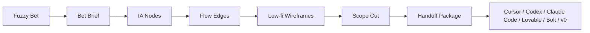

# David

<p align="right">
  <strong>Language:</strong>
  English |
  <a href="./README.zh-CN.md">简体中文</a>
</p>

David is a desktop-first product blueprint generator for AI indie builders.

It turns a fuzzy product Bet into a structured blueprint:

```text
Bet -> IA -> Flow -> Low-fi Wireframe -> Scope -> Handoff
```

The product is now in **David Mode B**. Older AI PM Doctor / diagnosis / evidence-validation files are legacy context only.

## Current Product Truth

The source of truth lives in:

```text
docs/david-mode-b/
  david_mode_b_batch6_final_absorb_plan.md
  david_mode_b_batch5_absorb_plan.md
  david_mode_b_batch2_absorb_plan.md
  david_mode_b_batch3_absorb_plan.md
  david_mode_b_batch4_absorb_plan.md
  david_mode_b_batch1_absorb_plan.md
```

Priority order:

1. Batch 6 final product definition
2. Batch 5 implementation and critic plan
3. Batch 2 technical architecture, data model, and AI pipeline
4. Batch 3 scope and handoff
5. Batch 4 visual and demo direction
6. Batch 1 positioning, user, and market

If any legacy file conflicts with these Mode B documents, the Mode B documents win.

## Product Positioning

David Mode B is not a chat-first AI PM, generic dashboard, PRD bot, whiteboard, no-code builder, UI generator, or coding agent.

It is the blueprint layer before AI coding tools.

| User problem | David's job |
|---|---|
| "I have a product idea but do not know how to structure the first version." | Normalize the Bet and generate an IA / flow / wireframe structure. |
| "I do not know what pages, states, and user paths the MVP needs." | Turn the Bet into a canvas of pages, flows, states, and node details. |
| "AI coding tools drift because my prompt is vague." | Compile the blueprint into Markdown, JSON, and agent-specific handoff prompts. |
| "I keep building too much." | Mark In MVP / Later / Excluded, no-gos, rabbit holes, dependencies, and acceptance criteria. |

## Core Experience

The core UI is **Blueprint Canvas**.

Chat may exist as an input/helper, but it is not the main interface.



## MVP Walking Skeleton

Build only the smallest product loop:

1. Bet Intake
2. Blueprint Canvas
3. Node Detail
4. Low-fi Wireframe Preview
5. Scope Cut / Scope Sheet
6. Handoff Export
7. Basic Blueprint Validator

Implementation order:

1. Contract first: TypeScript domain types, Zod schemas, mock `BlueprintDocument`
2. Workspace shell: left sidebar, top bar, canvas, right inspector, optional bottom dock
3. Blueprint Canvas: React Flow renderer, custom nodes/edges, layer toggles
4. Node Detail: why exists, user task, CTA, inputs, outputs, states, scope, acceptance criteria
5. Wireframe Preview: deterministic JSON block renderer, low-fi only
6. Scope: In MVP / Later / Excluded, no-gos, rabbit holes, dependencies, AC coverage
7. Handoff: Markdown, JSON, and agent-specific prompts
8. Validator: completeness, flow validity, wireframe coverage, handoff sufficiency

## Visual Direction

Use **Quiet Blueprint**:

- desktop-first
- canvas-first
- clean, minimal, precise
- light-first
- neutral canvas
- semantic accents only
- 2.5D only through stacked cards, subtle shadow, z-index, and selected-node lift

Avoid flashy AI gradients, glassmorphism, dashboard KPI walls, true 3D, and high-fidelity design generation.

## Current Repository State

This branch is mid-pivot cleanup.

Current truth:

- `docs/david-mode-b/` defines the new Mode B product.
- `docs/legacy-before-pivot/` archives old Mode A specs, research, and design notes.
- The active app surface has been reduced to a Mode B pivot shell. Legacy Mode A runtime code was removed from the default web and desktop entry points.
- The next implementation should rebuild from contracts and fixtures rather than refactor the old diagnosis components.

Useful infrastructure already exists:

- Next.js App Router
- TypeScript strict mode
- Tauri desktop shell
- Vite desktop entry
- localStorage/Tauri service pattern

Missing for Mode B implementation:

- Zod contracts
- `BlueprintDocument` fixture
- React Flow canvas
- Zustand workspace store
- deterministic wireframe renderer
- scope sheet
- handoff exporter
- blueprint validator

## Repository Structure

```text
app/                     Current Next.js Mode B pivot shell
desktop/                 Vite desktop entry for Tauri
src-tauri/               Tauri desktop shell
docs/
  david-mode-b/          Current product truth
  legacy-before-pivot/   Archived pre-pivot context
assets/                  Legacy visual assets
```

## Development

Prerequisites:

- Node.js 20+ recommended
- npm 10+
- Rust toolchain for Tauri desktop builds

```bash
npm install
npm run dev
npm run typecheck
npm run build
npm run desktop:dev-ui
npm run tauri:dev
```

The local web dev server defaults to [http://localhost:3000](http://localhost:3000).
The desktop dev UI defaults to [http://127.0.0.1:1420](http://127.0.0.1:1420).

## Working Rule

`BlueprintDocument` must become the source of truth.

React Flow nodes/edges are only render projections. Handoff exports must compile from the blueprint snapshot, not from freeform LLM prose.
