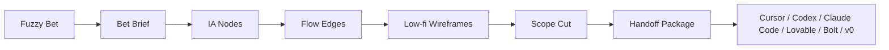

# David

<p align="right">
  <strong>语言：</strong>
  <a href="./README.md">English</a> |
  简体中文
</p>

David 是一个面向 AI 独立开发者的 desktop-first 产品蓝图生成器。

它把模糊的产品 Bet 转化成结构化蓝图：

```text
Bet -> IA -> Flow -> Low-fi Wireframe -> Scope -> Handoff
```

当前产品已经进入 **David Mode B**。旧的 AI PM Doctor / 产品诊断 / 证据验证文件只作为历史上下文保留。

## 当前产品真源

当前事实来源在：

```text
docs/david-mode-b/
  david_mode_b_batch6_final_absorb_plan.md
  david_mode_b_batch5_absorb_plan.md
  david_mode_b_batch2_absorb_plan.md
  david_mode_b_batch3_absorb_plan.md
  david_mode_b_batch4_absorb_plan.md
  david_mode_b_batch1_absorb_plan.md
```

读取优先级：

1. Batch 6 最终产品定义
2. Batch 5 实施计划与 critic 计划
3. Batch 2 技术架构、数据模型、AI pipeline
4. Batch 3 scope 与 handoff
5. Batch 4 视觉与 demo 方向
6. Batch 1 定位、用户与市场

如果旧文件与这些 Mode B 文档冲突，以 Mode B 文档为准。

## 产品定位

David Mode B 不是 chat-first AI PM、通用 dashboard、PRD bot、whiteboard、no-code builder、UI generator 或 coding agent。

它是 AI coding 工具之前的 blueprint layer。

| 用户问题 | David 的工作 |
|---|---|
| “我有产品想法，但不知道第一版该怎么组织。” | 标准化 Bet，并生成 IA / flow / wireframe 结构。 |
| “我不知道 MVP 需要哪些页面、状态和用户路径。” | 把 Bet 变成页面、流程、状态和节点详情组成的 canvas。 |
| “AI coding 工具总是跑偏，因为我的 prompt 太散。” | 把蓝图编译成 Markdown、JSON 和 agent-specific handoff prompts。 |
| “我总是做太多。” | 标记 In MVP / Later / Excluded、no-gos、rabbit holes、dependencies 和 acceptance criteria。 |

## 核心体验

核心 UI 是 **Blueprint Canvas**。

Chat 可以作为输入或辅助，但不能成为主界面。



## MVP Walking Skeleton

只构建最小产品闭环：

1. Bet Intake
2. Blueprint Canvas
3. Node Detail
4. Low-fi Wireframe Preview
5. Scope Cut / Scope Sheet
6. Handoff Export
7. Basic Blueprint Validator

实现顺序：

1. Contract first：TypeScript domain types、Zod schemas、mock `BlueprintDocument`
2. Workspace shell：左侧栏、顶部栏、canvas、右侧 inspector、可选 bottom dock
3. Blueprint Canvas：React Flow renderer、custom nodes/edges、layer toggles
4. Node Detail：why exists、user task、CTA、inputs、outputs、states、scope、acceptance criteria
5. Wireframe Preview：确定性的 JSON block renderer，只做低保真
6. Scope：In MVP / Later / Excluded、no-gos、rabbit holes、dependencies、AC coverage
7. Handoff：Markdown、JSON、agent-specific prompts
8. Validator：完整性、flow 合法性、wireframe 覆盖、handoff 充分性

## 视觉方向

使用 **Quiet Blueprint**：

- desktop-first
- canvas-first
- clean, minimal, precise
- light-first
- neutral canvas
- semantic accents only
- 2.5D 只通过 stacked cards、subtle shadow、z-index 和 selected-node lift 表达

避免 AI 渐变、玻璃拟态、dashboard KPI wall、真 3D 和高保真 UI 生成。

## 当前仓库状态

这个 branch 处于 pivot cleanup 阶段。

当前事实：

- `docs/david-mode-b/` 定义新的 Mode B 产品。
- `docs/legacy-before-pivot/` 归档旧 Mode A specs、research 和 design notes。
- 当前活跃 app surface 已收缩成 Mode B pivot shell。旧 Mode A runtime code 已从默认 Web 与 desktop 入口移除。
- 下一步实现应从 contracts 和 fixtures 重建，而不是继续重构旧诊断组件。

已有可复用基础设施：

- Next.js App Router
- TypeScript strict mode
- Tauri desktop shell
- Vite desktop entry
- localStorage / Tauri service pattern

Mode B 仍缺：

- Zod contracts
- `BlueprintDocument` fixture
- React Flow canvas
- Zustand workspace store
- deterministic wireframe renderer
- scope sheet
- handoff exporter
- blueprint validator

## 仓库结构

```text
app/                     当前 Next.js Mode B pivot shell
desktop/                 Tauri 使用的 Vite desktop entry
src-tauri/               Tauri desktop shell
docs/
  david-mode-b/          当前产品真源
  legacy-before-pivot/   pre-pivot 历史上下文
assets/                  旧视觉资产
```

## 开发

环境要求：

- 推荐 Node.js 20+
- npm 10+
- Tauri desktop build 需要 Rust toolchain

```bash
npm install
npm run dev
npm run typecheck
npm run build
npm run desktop:dev-ui
npm run tauri:dev
```

本地 Web dev server 默认运行在 [http://localhost:3000](http://localhost:3000)。
Desktop dev UI 默认运行在 [http://127.0.0.1:1420](http://127.0.0.1:1420)。

## 工作原则

`BlueprintDocument` 必须成为 source of truth。

React Flow nodes/edges 只能是渲染投影。Handoff export 必须从 blueprint snapshot 编译出来，不能依赖 LLM 自由发挥。
