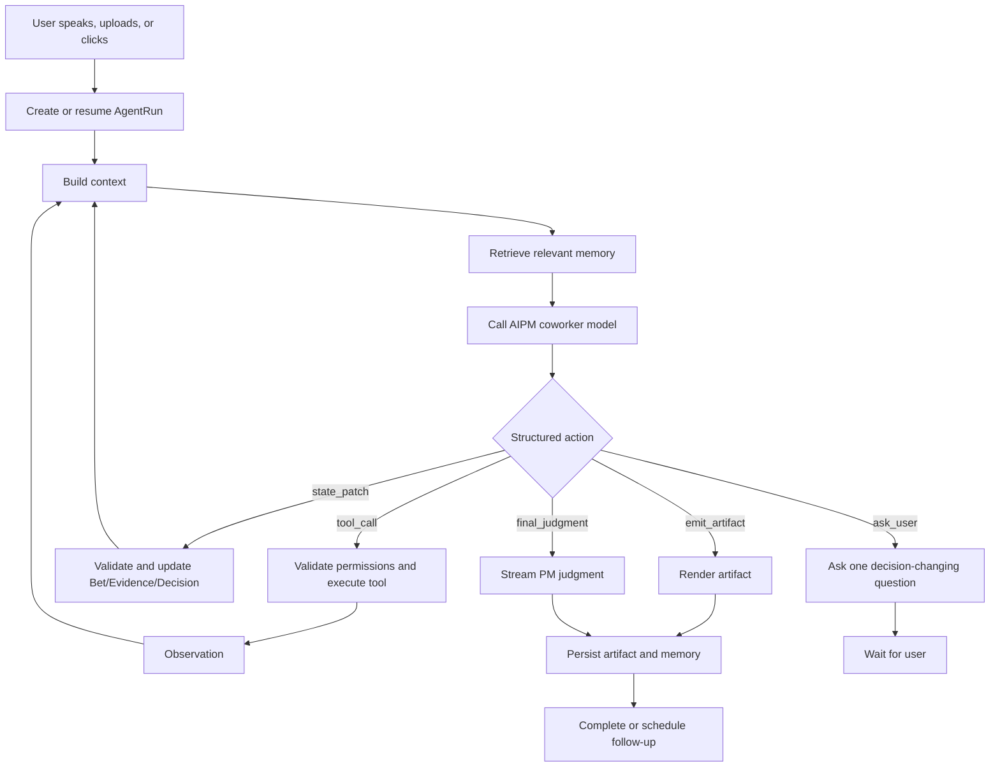
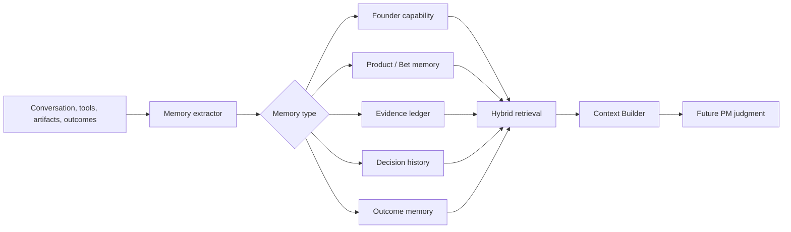
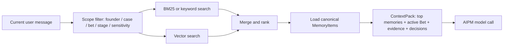

# Agent Workflows

## Purpose

This file defines how David works as an agent-native AI PM coworker.

The word "workflow" does not mean a rigid user-facing flow. The user should be able to speak naturally. David should infer the situation, choose the right PM action, call tools, update structured product state, explain the judgment, and preserve memory.

This spec defines the operating framework behind that behavior:

```text
free-form user input
-> AgentRun
-> context and memory retrieval
-> PM action selection
-> tool / state / memory execution
-> visible PM feedback
-> artifact and decision output
-> learning loop
```

## Source Relationship

| File | Role |
|---|---|
| `00_product_principles.md` | Product identity: AI PM coworker, not PRD bot or generic chatbot. |
| `01_target_users.md` | Target users, constraints, and founder capability map. |
| `02_user_scenarios.md` | Real entry situations the agent should infer silently. |
| `03_pm_reasoning_protocol.md` | Hidden PM reasoning loop. |
| `04_bet_model.md` | Core object the agent frames and updates. |
| `05_evidence_model.md` | Evidence and claim system the agent must respect. |
| `06_decision_policy.md` | Decision outputs, confidence, PRD gate, and failure modes. |
| `07_agent_workflows.md` | Runtime behavior: how the PM coworker acts, uses tools, updates memory, and responds. |

## Core Thesis

David is one PM coworker agent with multiple internal work modes.

The user should not need to choose "idea workflow", "review workflow", "research workflow", or "PRD workflow" first. David should infer the stage, ask only decision-changing questions, and move the work forward.

The visible product form is:

```text
conversation
+ current Bet
+ evidence ledger
+ decision / next action
+ artifacts
+ memory
```

The backend product form is:

```text
AgentRun harness
+ PM protocol
+ typed state
+ tool registry
+ memory system
+ event stream
+ guardrails
```

Core implementation components:

| Component | Responsibility |
|---|---|
| `AgentRunExecutor` | Owns the loop, step/action lifecycle, cancellation, resume, and completion. |
| `ContextBuilder` | Packs current message, active state, relevant memory, evidence, tools, and policy into model context. |
| `PolicyGate` | Validates action schema, permission, privacy, evidence rules, and PRD/coding handoff gates. |
| `ToolExecutor` | Executes approved structured tools and returns compact observations. |
| `StateReducer` | Applies validated domain events to canonical state. |
| `EvidenceStore` | Stores Evidence Cards, Claims, sources, contradictions, and source bundles. |
| `MemoryStore` | Stores durable founder/product/decision/outcome memory and retrieval indexes. |
| `DecisionEngine` | Applies `06_decision_policy.md` and produces Decision Records. |
| `ArtifactEmitter` | Emits user-visible memos, tests, reports, scripts, and build handoffs. |
| `EventStream` | Streams progress, tool calls, questions, artifacts, decisions, and errors to the UI. |

Operating rule:

```text
LLM proposes.
Harness validates.
PolicyGate decides whether action is allowed.
ToolExecutor executes.
StateReducer applies domain events.
Store remembers.
UI observes.
```

## Design Principles

| Principle | Meaning For David |
|---|---|
| Flexible chat, structured backend | The user talks naturally; the system maintains Bet, Evidence, Decision, Artifact, and Memory objects. |
| Model proposes, harness executes | The LLM may choose actions; validated code executes tools, persists state, and enforces gates. |
| Agentic, not menu-driven | Work modes are inferred from context and can change mid-run. |
| Few high-leverage tools | The main agent should not see a huge unscoped tool menu. Complex work uses sub-runs with narrower toolsets. |
| Evidence before output polish | Research and source-backed claims must precede confident decisions and specs. |
| Progress is visible | The user sees what David is checking, collecting, deciding, and producing. |
| Memory compounds judgment | Founder capability, product history, evidence, decisions, and outcomes must affect future advice. |
| No hidden fake certainty | David must expose confidence, missing evidence, and what would change the decision. |
| No PRD laundering | If the PRD gate is blocked, David may create tests and learning prototypes, not full build specs. |

## Primary Interaction Model

The primary entry point is a chat/workbench, not a form-only intake or assessment flow.

Acceptable user inputs:

- messy text: "I built this but nobody uses it"
- idea fragments
- product URLs
- screenshots
- competitor links
- social complaints
- metrics
- user interview notes
- launch results
- "what should I do next?"
- "help me think like a PM"

The UI may offer shortcuts, but they should only seed a conversation. They must not become the product's control model.

| User Surface | Purpose |
|---|---|
| Chat | Natural entry, clarification, PM discussion, challenge, and decision explanation. |
| Current Bet panel | Shows what David believes is being judged. |
| Evidence drawer | Shows source-backed claims, strength, confidence, and contradictions. |
| Decision card | Shows build/test/kill/narrow/wait/iterate, confidence, and PRD gate. |
| Next action card | Shows the one action that matters now. |
| Artifact area | Shows memos, tests, outreach, interview scripts, reports, or specs. |
| Memory drawer | Shows durable facts David will reuse. |

## AgentRun

An `AgentRun` is one observable unit of agent work. It may be short, like answering a PM question, or long, like researching complaints and producing a test plan.

Canonical flow:

```text
User message / UI event
-> AgentRun
-> AgentStep
-> AgentAction
-> ToolCall / StatePatch / Artifact / Question / FinalJudgment
-> MemoryUpdate
```

### AgentRun Schema

| Field | Required | Meaning |
|---|---:|---|
| `run_id` | yes | Stable ID for this run. |
| `case_id` | yes | Founder/product case this run belongs to. |
| `created_at` | yes | Run start time. |
| `status` | yes | `running`, `waiting_for_user`, `completed`, `failed`, `cancelled`, `interrupted`, `backgrounded`. |
| `trigger` | yes | `chat_message`, `url_added`, `artifact_uploaded`, `metric_added`, `button_action`, `scheduled_review`. |
| `user_intent_guess` | yes | Agent's current guess, not a hard route. |
| `inferred_scenario_id` | optional | S1-S6 from `02_user_scenarios.md`, if useful. |
| `active_bet_id` | optional | Bet being worked on. |
| `active_decision_id` | optional | Latest decision, if any. |
| `todos` | yes | Visible work plan for multi-step runs. |
| `tool_calls` | yes | Tool calls and observations. |
| `state_patches` | yes | Proposed and applied updates to Bet, Evidence, Decision, or Memory. |
| `artifacts` | yes | Outputs emitted during the run. |
| `permissions` | yes | User approvals or denials. |
| `events` | yes | Streamed lifecycle events. |
| `final_output` | optional | Final answer, judgment, or next action. |

### AgentState Schema

`AgentState` is the canonical product state for one founder/product case. The LLM may read a packed view of it, but it does not own or mutate it directly.

| Field | Required | Meaning |
|---|---:|---|
| `case_id` | yes | Founder/product case ID. |
| `founder_profile_id` | yes | Founder capability and preference profile. |
| `active_bet_id` | optional | Current Bet being judged. |
| `bet_ids` | yes | Active, stale, killed, or pivoted Bets. |
| `evidence_ids` | yes | Evidence Cards relevant to the case. |
| `claim_ids` | yes | Claims derived from evidence. |
| `decision_ids` | yes | Decision history. |
| `artifact_ids` | yes | Outputs created for the case. |
| `memory_ids` | yes | Durable memories linked to this case. |
| `open_question_ids` | optional | Questions waiting for user answer. |
| `active_run_ids` | optional | Running/backgrounded AgentRuns. |
| `last_reviewed_at` | optional | Last meaningful PM review. |
| `status` | yes | `active`, `waiting`, `testing`, `building`, `learning`, `archived`. |

State rule:

```text
model output -> validated AgentAction -> domain event -> StateReducer -> AgentState
```

The app owns state. The model only proposes state changes.

### Runtime Object Schemas

These schemas are implementation contracts. They keep David agentic without letting model output bypass state, evidence, permission, or PRD gates.

#### AgentStep

| Field | Required | Meaning |
|---|---:|---|
| `step_id` | yes | Stable step ID. |
| `run_id` | yes | Parent run. |
| `seq` | yes | Monotonic sequence number. |
| `created_at` | yes | Step start time. |
| `status` | yes | `running`, `completed`, `failed`, `skipped`, `cancelled`. |
| `purpose` | yes | What this step is trying to resolve. |
| `input_summary` | yes | Context used by the model or tool. |
| `action_ids` | yes | Actions proposed during this step. |
| `observation_ids` | optional | Tool or state observations returned. |
| `error` | optional | Failure message, retry count, and recoverability. |

#### ScratchpadEntry

Scratchpad is run-local working memory. It is not durable product memory.

| Field | Required | Meaning |
|---|---:|---|
| `scratchpad_entry_id` | yes | Stable ID. |
| `run_id` | yes | Parent run. |
| `step_id` | optional | Related step. |
| `action_id` | optional | Related action. |
| `kind` | yes | `thought_summary`, `tool_result_summary`, `evidence_note`, `risk_note`, `open_issue`. |
| `content` | yes | Compact note used by later steps. |
| `source_ids` | optional | Tool/result/evidence IDs. |
| `visibility` | yes | `internal` or `user_visible`. |
| `expires_at_run_end` | yes | Scratchpad should normally expire when the run completes. |

Scratchpad rules:

- store compact summaries, not raw large tool outputs
- keep raw tool/source data in EvidenceStore or ArtifactStore
- do not use scratchpad as long-term memory
- cancelled or failed runs may keep audit logs, but should not create durable memory by default

#### AgentAction

| Field | Required | Meaning |
|---|---:|---|
| `action_id` | yes | Stable action ID. |
| `run_id` | yes | Parent run. |
| `step_id` | yes | Parent step. |
| `seq` | yes | Action order within the run. |
| `type` | yes | One of the action enum values below. |
| `payload` | yes | Structured input for the action. |
| `validation_status` | yes | `pending`, `valid`, `invalid`, `needs_permission`. |
| `validator_result` | optional | Schema/gate result and failure reasons. |
| `permission_level` | yes | See Permission Levels. |
| `result_id` | optional | Tool result, state patch, artifact, memory update, or final output. |
| `retry_count` | yes | Number of retries. |
| `audit_trace` | yes | Source action, model call ID if available, and linked evidence/state IDs. |

#### ToolCall

| Field | Required | Meaning |
|---|---:|---|
| `tool_call_id` | yes | Stable ID. |
| `action_id` | yes | Parent action. |
| `tool_name` | yes | Registered tool name. |
| `permission_level` | yes | Required permission level. |
| `input` | yes | Validated input payload. |
| `redaction` | yes | `none`, `public_safe`, `private`, or `sensitive`. |
| `audit_trace` | yes | Source action, permission decision, and linked state/evidence IDs. |
| `status` | yes | `queued`, `running`, `completed`, `failed`, `denied`, `cancelled`. |
| `started_at` | optional | Start time. |
| `completed_at` | optional | Completion time. |
| `output_summary` | optional | Human-readable result summary. |
| `observation_payload` | optional | Structured result. |
| `domain_event_ids` | optional | State changes proposed by the tool result. |
| `error` | optional | Error category and message. |

#### DomainEvent

Domain events are the only way validated actions change canonical state.

| Field | Required | Meaning |
|---|---:|---|
| `domain_event_id` | yes | Stable ID. |
| `run_id` | yes | Parent run. |
| `source_action_id` | yes | Action that produced this event. |
| `type` | yes | `case_updated`, `bet_updated`, `evidence_created`, `claim_created`, `decision_created`, `artifact_created`, `memory_proposed`, `memory_applied`, `permission_recorded`. |
| `payload` | yes | Structured domain payload. |
| `validator` | yes | Schema/policy used before reduce. |
| `created_at` | yes | Creation time. |
| `applied_at` | optional | Reducer apply time. |

#### Question

| Field | Required | Meaning |
|---|---:|---|
| `question_id` | yes | Stable ID. |
| `run_id` | yes | Parent run. |
| `action_id` | yes | Source action. |
| `question_text` | yes | User-visible question. |
| `why_needed` | yes | What decision or confidence change this answer affects. |
| `blocks_run` | yes | Whether the run must wait. |
| `expected_answer_shape` | optional | Short text, URL, metric, file, choice, or permission. |
| `fallback_if_unanswered` | optional | Assumption the agent will use if allowed. |
| `created_at` | yes | Creation time. |

#### StatePatch

| Field | Required | Meaning |
|---|---:|---|
| `patch_id` | yes | Stable ID. |
| `action_id` | yes | Source action. |
| `target_type` | yes | `case`, `bet`, `assumption`, `evidence`, `decision`, `artifact`, `memory`. |
| `target_id` | optional | Existing object ID; absent for create. |
| `operation` | yes | `create`, `update`, `supersede`, `archive`, `delete_proposal`. |
| `before` | optional | Prior state or diff summary. |
| `after` | yes | Proposed state or diff summary. |
| `validator` | yes | Schema or policy used. |
| `validation_status` | yes | `valid`, `invalid`, `needs_permission`. |
| `applied_by` | optional | `system`, `user`, `agent`, or `admin`. |
| `applied_at` | optional | Apply time. |
| `rollback` | optional | Rollback/error behavior. |

#### Artifact

| Field | Required | Meaning |
|---|---:|---|
| `artifact_id` | yes | Stable ID. |
| `run_id` | yes | Parent run. |
| `type` | yes | `memo`, `bet_card`, `evidence_report`, `test_plan`, `interview_script`, `landing_copy`, `outreach`, `pricing_test`, `build_spec`, `coding_prompt`, `launch_review`. |
| `readiness_required` | yes | Minimum Bet readiness required. |
| `decision_id` | optional | Required for decision-bearing artifacts and all build handoffs. |
| `prd_gate_required` | yes | `allowed`, `blocked_ok`, or `not_applicable`. |
| `source_ids` | optional | Linked Evidence, Bet, Decision, or Memory IDs. |
| `content` | yes | Artifact body or pointer. |
| `visibility` | yes | `user_visible`, `internal`, `admin_only`. |
| `created_at` | yes | Creation time. |

#### FinalJudgment

| Field | Required | Meaning |
|---|---:|---|
| `judgment_id` | yes | Stable ID. |
| `run_id` | yes | Parent run. |
| `decision_id` | yes | Decision record conforming to `06_decision_policy.md`. |
| `bet_id` | yes | Bet being judged. |
| `evidence_ids` | yes | Evidence supporting, weakening, or contradicting the judgment. |
| `decision` | yes | `build`, `test`, `kill`, `narrow`, `wait`, or `iterate`. |
| `confidence` | yes | `low`, `medium`, or `high`. |
| `prd_gate` | yes | `allowed` or `blocked`. |
| `missing_fields` | optional | Required fields still missing. |
| `assumed_fields` | optional | Inferred fields and confidence downgrade. |
| `memory_update_ids` | yes | Proposed/applied memory updates. |

#### MemoryUpdate

| Field | Required | Meaning |
|---|---:|---|
| `memory_update_id` | yes | Stable ID. |
| `run_id` | yes | Parent run. |
| `source_ids` | yes | Message, evidence, decision, artifact, or tool result IDs. |
| `memory_type` | yes | See Memory Types. |
| `content` | yes | Structured durable fact. |
| `confidence` | yes | `low`, `medium`, or `high`. |
| `sensitivity` | yes | `public`, `private`, `sensitive`. |
| `status` | yes | `proposed`, `validated`, `applied`, `rejected`, `expired`. |
| `approval_required` | yes | Whether user/admin approval is needed. |
| `review_trigger` | optional | Expiration date or condition. |
| `contradiction` | optional | What this memory challenges. |

#### SubRun

| Field | Required | Meaning |
|---|---:|---|
| `subrun_id` | yes | Stable ID. |
| `parent_run_id` | yes | Parent run. |
| `objective` | yes | Bounded task. |
| `allowed_tools` | yes | Narrow tool list for this sub-run. |
| `context_snapshot_id` | yes | Context provided to the sub-run. |
| `output_contract` | yes | Required result schema. |
| `budget` | optional | Token/time/tool budget. |
| `timeout` | optional | Time limit. |
| `status` | yes | `running`, `completed`, `failed`, `cancelled`, `timed_out`. |
| `confidence` | optional | Confidence in sub-run result. |
| `result_summary` | optional | Summary returned to parent. |

#### AgentRunEvent

| Field | Required | Meaning |
|---|---:|---|
| `event_id` | yes | Stable event ID. |
| `run_id` | yes | Parent run. |
| `step_id` | optional | Related step. |
| `seq` | yes | Monotonic event sequence. |
| `created_at` | yes | Event time. |
| `type` | yes | Event enum from Event Stream. |
| `payload` | yes | Structured event body. |
| `visibility` | yes | `user_visible`, `internal`, `admin_only`. |
| `severity` | yes | `info`, `warning`, `error`. |
| `redaction` | yes | `none`, `public_safe`, `private`, `sensitive`. |

## Hard Runtime Invariants

These invariants override model output.

1. A decision-bearing response must include a `decision_id` that satisfies the output contract in `06_decision_policy.md`.
2. A `build_spec` or `coding_prompt` artifact requires `prd_gate: allowed`, unless it is explicitly marked `override_build` and scoped as a reversible learning prototype.
3. If evidence is weak or WTP/costly behavior is unresolved for a revenue-dependent Bet, David must create a test/narrow/wait/iterate/kill path, not a full PRD.
4. Any claim that affects a Bet, risk, confidence, or decision must link to Evidence Cards or be marked as an assumption.
5. Memory writes must pass `proposed -> validated -> applied`; sensitive memory cannot be auto-applied without permission.
6. Tool calls must declare permission level, redaction class, and audit trace before execution.
7. Current user correction overrides stale memory and prior model inference.
8. The parent AgentRun owns the final PM judgment; sub-runs provide bounded evidence, critique, or artifacts.
9. Domain state changes must go through StateReducer; model output cannot directly mutate canonical state.
10. Cancelled, denied, or interrupted runs do not write long-term memory unless the user explicitly asks to preserve a specific result.

## Runtime Loop



### Pseudocode

```ts
async function runDavidAgent(input: UserInput, caseId: string) {
  const run = createAgentRun(input, caseId)

  while (!run.done) {
    const context = buildContext({
      productIdentity: "David is a personal AI PM coworker",
      pmProtocol: loadSpec("03_pm_reasoning_protocol.md"),
      decisionPolicy: loadSpec("06_decision_policy.md"),
      currentCase: readCase(caseId),
      activeBet: readActiveBet(caseId),
      evidence: readRelevantEvidence(caseId),
      memory: retrieveMemory(input, caseId),
      recentConversation: compactRecentMessages(caseId),
      availableTools: getMainToolSchemas(),
      relevantSkills: getSkillSummaries(input)
    })

    const action = await model.proposeAction(context)
    const validated = validateAction(action)
    streamEvent(validated)

    if (validated.type === "ask_user") {
      markWaitingForUser(run, validated.question)
      return
    }

    if (validated.type === "tool_call") {
      const result = await executeToolWithPermissions(validated)
      persistObservation(run, result)
      appendScratchpadSummary(run, result)
      applyDomainEvents(result.domainEvents)
      continue
    }

    if (validated.type === "state_patch") {
      applyValidatedStatePatch(validated.patch)
      continue
    }

    if (validated.type === "emit_artifact") {
      enforceArtifactGate(validated.artifact, readLatestDecision(caseId))
      persistArtifact(validated.artifact)
      continue
    }

    if (validated.type === "final_judgment") {
      enforceDecisionContract(validated.output, loadSpec("06_decision_policy.md"))
      const memoryUpdates = proposeMemoryUpdates(run.trace)
      validateMemoryUpdates(memoryUpdates)
      applyAutoSafeMemory(memoryUpdates)
      queueApprovalRequiredMemory(memoryUpdates)
      completeRun(run, validated.output)
      return
    }
  }
}
```

## Context Builder

The `ContextBuilder` decides what the model sees for the next step.

Context order:

1. Product identity and behavioral rules.
2. PM reasoning protocol.
3. Decision policy and PRD gate.
4. Current user message and recent conversation.
5. Active Case, Bet, Evidence, Decision, Next Action, and Artifacts.
6. Relevant founder memory.
7. Relevant product and decision memory.
8. Relevant evidence and source summaries.
9. Tool schemas and skill summaries.
10. Output contract.

Rules:

- Context precedence: current user correction > source-backed evidence > active typed state > memory > model inference.
- Do not include all memory by default; retrieve only relevant memory.
- Do not treat memory as truth unless it has source, date, confidence, and current status.
- Prefer current user correction over old memory.
- Mark stale or contradicted memory before using it.
- Keep raw source access available for audit.
- Hide chain-of-thought; expose concise rationale, evidence, and uncertainty instead.

## Agent Actions

The model may propose actions from a constrained enum. The harness validates each action before execution.

| Action | Purpose | Result |
|---|---|---|
| `answer` | Respond when no tool/state change is needed. | Visible response. |
| `ask_user` | Ask for missing context that changes the decision. | Run waits for user. |
| `todo_update` | Show plan/progress during multi-step work. | Updated visible todos. |
| `frame_bet` | Create or update the current Bet. | Bet state patch. |
| `create_assumption` | Add a testable assumption. | Assumption state patch. |
| `create_evidence_card` | Convert a source/fact into evidence. | Evidence card. |
| `search_evidence` | Find external or local evidence. | Evidence research sub-run or tool call. |
| `inspect_artifact` | Review URL, screenshot, notes, metrics, or prototype. | Observation and claims. |
| `assess_risk` | Update value/usability/feasibility/viability/trust risk. | Risk map. |
| `decide` | Apply `06_decision_policy.md`. | Decision record. |
| `design_test` | Create strongest feasible evidence test. | Test plan and assets. |
| `emit_artifact` | Produce memo, script, report, copy, spec, or prompt. | Artifact. |
| `request_permission` | Ask before sensitive/external/high-impact action. | Permission event. |
| `save_memory` | Propose durable memory update. | Memory write. |
| `start_subrun` | Delegate bounded research/review work. | Sub-run result. |
| `handoff_to_coding_agent` | Create coding spec only if PRD gate allows. | Build artifact. |
| `safe_refusal` | Refuse unsafe or unsupported request. | Refusal plus safer alternative. |

## V1 Main Tool Registry

The main agent should start with a small explicit tool list. More specialized tools should be hidden behind sub-runs.

| Tool | Purpose | Permission |
|---|---|---|
| `todo_update` | Show plan and progress. | `local_write` |
| `ask_user` | Ask one decision-changing question. | `read_only` |
| `memory_search` | Retrieve relevant approved memory. | `read_only` |
| `bet_upsert` | Create or update current Bet. | `local_write` |
| `evidence_add` | Create Evidence Card from user fact/source/tool result. | `local_write` |
| `evidence_search` | Search local evidence and approved source bundles. | `read_only` |
| `run_research_subrun` | Start bounded evidence/competitor/review research. | `external_read` |
| `diagnose_risk` | Assess four risks and trust risk. | `local_write` |
| `emit_artifact` | Create user-visible PM artifact. | `local_write` |
| `propose_memory_write` | Propose durable memory update. | `local_write` or `sensitive_data` |

Research sub-runs may use narrower tools:

```text
web_search
fetch_url
extract_claims
source_bundle_update
evidence_card_emit
```

## Internal Work Modes

Modes are inferred, not user-selected. David may switch modes inside one run.

| Mode | Trigger | PM Job | Typical Output |
|---|---|---|---|
| Orient | Messy or broad input. | Understand stage, decision needed, and missing context. | Situation assessment and next question/action. |
| Bet Framing | Idea, complaint, product link, or vague opportunity. | Convert mess into target user, situation, job, solution guess, outcome. | Bet card. |
| Evidence Research | User provides weak evidence, platform links, or asks "is this real?" | Search, extract, cluster, and score evidence. | Evidence cards and claim summary. |
| Product Review | Product/prototype/landing page exists. | Inspect value proposition, IA, onboarding, trust, and feature scope. | Review memo and cut/iterate/test decision. |
| Metrics Review | User has traffic, activation, retention, churn, revenue, replies, or payment data. | Identify bottleneck and map metric to PM decision. | Metric review and experiment plan. |
| Decision Review | Enough Bet/evidence exists or user needs a call. | Apply build/test/kill/narrow/wait/iterate policy. | Decision card and PRD gate. |
| Test Design | Bet not ready but promising. | Design strongest feasible evidence test. | Test plan, script, copy, threshold. |
| Artifact Production | User needs a concrete PM output. | Create the artifact appropriate to readiness. | Memo, interview script, landing copy, outreach, brief, or spec. |
| Build Handoff | PRD gate is allowed or founder overrides. | Create bounded spec for Cursor/Codex/Lovable. | Evidence-backed build spec or override learning prototype. |
| Launch Learning | Test/build/launch result arrives. | Compare expectation with outcome and update memory. | Learning memo, next decision, memory update. |

## Tool Strategy

The main coworker agent should have a small set of high-leverage tools. Tools are structured commands, not generic backend endpoints.

### Main Tool Families

| Tool Family | Examples | Notes |
|---|---|---|
| State tools | `bet.upsert`, `assumption.upsert`, `decision.evaluate`, `case.read` | Own canonical PM state. |
| Evidence tools | `evidence.create`, `evidence.search`, `evidence.cluster`, `source.fetch` | Must preserve source and confidence. |
| Research tools | `web.search`, `platform.search`, `competitor.scan`, `review.mine` | Prefer sub-runs for complex research. |
| Artifact tools | `artifact.emit`, `artifact.update`, `report.render` | Artifacts can stream during a run. |
| Memory tools | `memory.search`, `memory.propose_write`, `memory.consolidate` | Writes should include source and confidence. |
| UX tools | `todo.update`, `ask_user`, `permission.request`, `open_panel` | Keep progress visible and controllable. |
| Handoff tools | `coding_spec.generate`, `prompt.generate` | Block unless PRD gate allows or override path is explicit. |

### Sub-Runs

Use sub-runs when the work is bounded and can benefit from a narrower toolset.

| Sub-Run | Toolset | Output |
|---|---|---|
| `evidence_research` | search, fetch, source bundle, evidence extraction | Evidence cards and contradictions. |
| `competitor_scan` | search, fetch, review mining, pricing extraction | Competitor evidence matrix. |
| `prototype_review` | screenshot/page inspection, heuristic review, evidence linkage | UX/value review memo. |
| `metrics_review` | metric parser, cohort reader, funnel analysis | Bottleneck and experiment plan. |
| `artifact_review` | critic checklist, spec gate, source audit | Review notes and required fixes. |

The parent agent owns the final judgment. A sub-run returns observations, evidence, and critique; it should not silently override the parent decision.

## Event Stream

The frontend should render `AgentRunEvent` objects, not raw model internals.

| Event | Meaning |
|---|---|
| `run.started` | Work began. |
| `run.resumed` | Existing run continued. |
| `step.started` | Agent started a visible step. |
| `todo.updated` | Plan/progress changed. |
| `tool.started` | Tool call began. |
| `tool.progress` | Long-running tool progress. |
| `tool.completed` | Tool returned observation. |
| `tool.failed` | Tool failed with recoverable or fatal error. |
| `permission.requested` | User approval required. |
| `state.patch.proposed` | Bet/evidence/decision/memory update proposed. |
| `state.patch.applied` | Validated state update persisted. |
| `evidence.updated` | Evidence card or claim added/changed. |
| `artifact.emitted` | Artifact became visible. |
| `decision.emitted` | Build/test/kill/narrow/wait/iterate decision emitted. |
| `memory.updated` | Durable memory created or updated. |
| `run.waiting_for_user` | Agent needs user input. |
| `run.completed` | Run finished. |
| `run.cancelled` | User cancelled work. |
| `run.interrupted` | User changed direction or a newer request superseded current work. |
| `run.backgrounded` | Long-running work moved to background with stop/resume control. |
| `run.failed` | Run failed clearly. |

## Feedback Contract

David should communicate like a senior PM coworker, not like a black-box automation system.

During a run:

- acknowledge the real decision being worked on
- show the current Bet or say it is still being framed
- show what evidence is being checked
- show when confidence is low
- ask only questions that change the decision
- challenge weak assumptions tactfully
- emit useful artifacts when they become useful, not only at the end

Final visible output should follow `06_decision_policy.md`:

```text
Situation assessment
Current Bet
Evidence summary
Riskiest assumption
Four risks
Decision: build / test / kill / narrow / wait / iterate
Confidence
Next action
Success threshold
What would change this decision
PRD gate
Memory updates
```

## Memory Lifecycle

Memory is not a transcript dump. Memory is a structured product asset.



### Memory Types

| Type | Examples |
|---|---|
| `founder_capability` | Coding skill, design taste, sales comfort, channels, language, budget, time. |
| `founder_preference` | Wants direct challenge, prefers EN/ZH, dislikes long theory, wants concise actions. |
| `product_context` | Product name, market, ICP, stage, constraints, positioning history. |
| `bet_memory` | Current and past Bets, pivots, killed assumptions. |
| `evidence_memory` | Source-backed claims, complaint clusters, payment signals, contradictions. |
| `decision_memory` | Prior decisions, confidence, PRD gate, override records. |
| `test_memory` | Test plans, scripts, thresholds, results. |
| `outcome_memory` | Payment, replies, activation, retention, churn, launch results. |
| `conversation_summary` | Compact run/session summary when needed for continuity. |
| `no_go_memory` | Explicitly rejected scopes, users, channels, or risky assumptions. |

### MemoryItem Schema

`MemoryUpdate` is the write process. `MemoryItem` is the durable object after a write is accepted.

| Field | Required | Meaning |
|---|---:|---|
| `memory_id` | yes | Stable ID. |
| `case_id` | yes | Founder/product case. |
| `founder_profile_id` | yes | Founder this memory belongs to. |
| `bet_id` | optional | Bet this memory relates to. |
| `kind` | yes | One of Memory Types. |
| `content` | yes | Structured durable fact or summary. |
| `source_run_id` | yes | Run that produced it. |
| `source_event_ids` | yes | Events/messages/tool results behind it. |
| `evidence_ids` | optional | Evidence linked to this memory. |
| `confidence` | yes | `low`, `medium`, or `high`. |
| `sensitivity` | yes | `public`, `private`, or `sensitive`. |
| `status` | yes | `active`, `stale`, `superseded`, `rejected`, `deleted`. |
| `created_at` | yes | Creation time. |
| `updated_at` | yes | Last update time. |
| `review_trigger` | optional | Date or condition for recheck. |

### Memory Write Rules

Every durable memory should include:

- source
- date
- confidence
- relevance
- current status
- contradiction if any
- review trigger or expiration when needed

Do not write:

- compliments as facts
- synthetic user opinions as evidence
- stale assumptions without status
- private/sensitive data unless the user explicitly provided it for the case
- product or market claims directly into memory before they become Evidence Cards
- durable memory from cancelled/interrupted runs unless explicitly preserved by the user

Non-claim case metadata can be auto-written after validation:

- product name
- founder language preference
- time/budget/channel constraints
- explicit no-gos
- stated communication preferences

Product, market, user, WTP, competitor, or metric claims should become Evidence Cards first, then memory can link to those Evidence Cards.

### Memory Retrieval Pipeline

Retrieval should be scoped before ranking. David should not search all memory blindly.



Retrieval rules:

- filter by founder/case first
- prefer active Bet and current stage
- exclude sensitive memories unless the current action is allowed to use them
- include stale memories only with a stale warning
- rank by semantic relevance, keyword match, linked entity, recency, confidence, and source quality
- load canonical rows after ranking; do not inject raw vector snippets as truth

### Memory Write States

Memory writes are not always automatic.

| State | Meaning | Who Can Apply |
|---|---|---|
| `proposed` | Agent suggests this should become memory. | Not yet durable. |
| `validated` | Schema, source, confidence, sensitivity, and contradiction checks passed. | System may apply if not sensitive. |
| `applied` | Durable memory is saved and available for retrieval. | System or user-approved write. |
| `rejected` | User/system rejected the memory. | Not retrieved. |
| `expired` | Memory is stale or superseded. | Retrieved only with stale warning. |

Auto-apply is allowed only for low-risk memory:

- founder preferences explicitly stated in conversation
- non-claim case metadata provided by the user
- public evidence summaries with source IDs
- non-sensitive decision outcomes

Approval is required for:

- customer data
- private metrics
- screenshots containing private information
- payment, revenue, or financial details
- third-party personal information
- any memory the user asks David not to remember

## Permission And Safety Policy

David should be autonomous in thinking, but conservative in external action.

### Permission Levels

| Level | Meaning | Default |
|---|---|---|
| `read_only` | Read local case state, current chat, and already approved memory. | Allowed. |
| `local_write` | Update local Bet, Evidence, Decision, Artifact, or non-sensitive Memory. | Allowed after validation. |
| `external_read` | Search/fetch public web or platform data. | Allowed when user asks for research or provides link. |
| `external_write` | Send, post, comment, email, DM, or submit forms. | Requires explicit approval. |
| `sensitive_data` | Access/store private metrics, customer data, screenshots, account exports. | Requires explicit approval and redaction. |
| `payment_purchase` | Charge, pay, subscribe, deposit, buy data, or start paid tools. | Requires explicit approval. |
| `background_task` | Run monitor, reminder, scheduled research, or follow-up. | Requires explicit approval and stop control. |

No extra permission needed:

- summarize current case
- update local Bet/evidence/decision state
- create local artifacts
- search public web when user asks for research
- retrieve existing local memory

Permission required:

- send messages, post content, or contact users
- make purchases, payments, deposits, or subscriptions
- connect private accounts or analytics
- store sensitive screenshots, customer data, or private metrics
- run background monitors
- generate a coding-agent handoff when PRD gate is blocked and user still wants to build

## PRD And Coding-Agent Handoff

David may produce build specs only when `06_decision_policy.md` allows it.

If PRD gate is blocked:

```text
No build spec yet.
Decision: test / kill / narrow / wait / iterate
Missing evidence:
Strongest next test:
What result would unlock build:
```

If the founder overrides:

```text
Override accepted.
This is not build-ready.
I will scope the smallest reversible learning prototype.
Learning metric:
Review trigger:
Accepted risk:
```

## Fine-Tuning Policy

Do not depend on fine-tuning for V1 product behavior.

V1 should use:

- system prompt and PM protocol
- context builder
- structured tools
- schemas
- memory retrieval
- deterministic gates
- real case review

Fine-tuning can be considered later when enough high-quality case traces exist:

- input situation
- framed Bet
- evidence cards
- decision
- artifact
- outcome after test/build/launch

Fine-tuning should improve style, extraction, and pattern recognition. It must not replace evidence gates, memory rules, or deterministic execution policy.

## Failure Modes

| Failure Mode | Guardrail |
|---|---|
| Workflow theater | Do not expose rigid flows as the core UX; use AgentRun behind natural chat. |
| Tool overuse | Keep main tools few; use sub-runs for bounded research. |
| Generic chatbot drift | Always update or reference Bet, Evidence, Decision, or Memory when relevant. |
| Endless questioning | Ask only decision-changing questions; otherwise proceed with assumptions and mark confidence. |
| Hidden uncertainty | Show confidence, missing evidence, and what would change the decision. |
| PRD laundering | Enforce PRD gate before coding specs. |
| Memory rot | Store date, confidence, status, contradiction, and review trigger. |
| Source laundering | LLM reasoning is not evidence without source or user-provided fact. |
| Subagent confusion | Parent agent owns final PM judgment; sub-runs produce evidence or critique only. |
| UI pretending to be backend | Frontend renders events and artifacts; backend owns decisions and state. |

## MVP Scope

For the first agentic MVP, implement the smallest useful loop:

1. Chat entry.
2. Context builder from current case, recent messages, and local memory.
3. Bet framing.
4. Evidence card creation from user-provided facts and light research.
5. Decision evaluation using `06_decision_policy.md`.
6. Test plan/artifact generation when PRD gate is blocked.
7. Memory proposal after each meaningful run.
8. Event stream for progress, tool calls, decisions, and artifacts.

Do not implement first:

- broad autonomous browsing without user goal
- automatic posting/outreach
- full multi-agent marketplace
- enterprise roadmap workflows
- fine-tuned model dependency
- broad coding-agent handoff before PRD gate works

## Acceptance Criteria

This spec is satisfied when a future implementation can:

- accept a free-form PM situation
- infer scenario without forcing the user into a fixed flow
- create or update a Bet
- retrieve relevant founder/product memory
- create source-backed evidence cards
- call tools with typed validation and permissions
- stream progress and artifacts
- make a build/test/kill/narrow/wait/iterate decision
- block PRD when evidence is weak
- generate the next useful PM artifact
- persist memory so future advice improves

## Source Notes

- Local specs: `docs/specs/00_product_principles.md` through `docs/specs/06_decision_policy.md`
- Local RetirePath architecture reference: `/Users/bytedance/Desktop/Work/RetirePath/AGENTS.md`
- Local RetirePath AgentRun ADR: `/Users/bytedance/Desktop/Work/RetirePath/spec/architecture/adr/0003-agent-harness-and-tooling.md`
- Local agentic repo map: `/Users/bytedance/Desktop/Work/RetirePath/reference/agentic_repos/README.md`
- Local memory references: `/Users/bytedance/Desktop/Work/RetirePath/reference/memory_repos/A-mem/README.md`, `/Users/bytedance/Desktop/Work/RetirePath/reference/memory_repos/mem0/README.md`, `/Users/bytedance/Desktop/Work/RetirePath/reference/memory_repos/langmem/README.md`, `/Users/bytedance/Desktop/Work/RetirePath/reference/memory_repos/hermes-agent/README.md`

## Local Implementation References

Future agents implementing this spec should treat the following local folders as reference material. They are not source-of-truth product requirements for David, but they contain useful implementation patterns for AgentRun harnesses, tool execution, event streams, sub-runs, memory, and long-context behavior.

### RetirePath App Reference

| Path | Use For |
|---|---|
| `/Users/bytedance/Desktop/Work/RetirePath` | A simple existing AI Agent app in the local workspace. Read this when implementing David's own app shell, agent harness, or state/event architecture. |
| `/Users/bytedance/Desktop/Work/RetirePath/AGENTS.md` | High-level agent architecture principles: one companion agent, typed harness, local state, tools as structured commands, no rigid intent router. |
| `/Users/bytedance/Desktop/Work/RetirePath/spec/architecture/adr/0001-agent-core-architecture.md` | Typed reducer/state-machine architecture and why app state should not be owned by the LLM. |
| `/Users/bytedance/Desktop/Work/RetirePath/spec/architecture/adr/0002-companion-agent-product-form.md` | Companion-chat product form and why cockpit/workbench artifacts should be secondary surfaces. |
| `/Users/bytedance/Desktop/Work/RetirePath/spec/architecture/adr/0003-agent-harness-and-tooling.md` | AgentRun harness, tool lifecycle, permissions, source bundles, cancellation/resume, and event stream design. |
| `/Users/bytedance/Desktop/Work/RetirePath/spec/architecture/frontend_agent_contract.md` | Frontend contract for rendering AgentRun events rather than owning business logic. |

### Agentic App References

Base folder:

```text
/Users/bytedance/Desktop/Work/RetirePath/reference/agentic_repos
```

Recommended reading order:

| Path | What To Learn |
|---|---|
| `/Users/bytedance/Desktop/Work/RetirePath/reference/agentic_repos/README.md` | Map of all local agentic references and license/source-hygiene notes. Start here. |
| `/Users/bytedance/Desktop/Work/RetirePath/reference/agentic_repos/learn-claude-code` | Minimal agent loop, tool dispatch, todo state, subagents, skill loading, compaction, background tasks, and task graph patterns. |
| `/Users/bytedance/Desktop/Work/RetirePath/reference/agentic_repos/dexter` | Research-agent patterns: planning, search/fetch, scratchpad, source traces, evals, loop limits. |
| `/Users/bytedance/Desktop/Work/RetirePath/reference/agentic_repos/opencode` | Session persistence, permissions, tool execution, summarization, and terminal-agent architecture. |
| `/Users/bytedance/Desktop/Work/RetirePath/reference/agentic_repos/crush` | Modern terminal-agent patterns: queued prompts, todo state, MCP/tools, hooks, permissions, background jobs, loop detection. |
| `/Users/bytedance/Desktop/Work/RetirePath/reference/agentic_repos/claudia` | Desktop GUI patterns for agent run history, stream viewer, stop control, metrics, checkpoints, and custom agents. Reference only; do not copy AGPL code. |

Do not use:

```text
/Users/bytedance/Desktop/Work/RetirePath/reference/agentic_repos/claude-code-repro
```

That folder is excluded because its own metadata identifies it as leaked/proprietary source. Do not read, copy, summarize, or depend on it.

### Memory Framework References

Base folder:

```text
/Users/bytedance/Desktop/Work/RetirePath/reference/memory_repos
```

Recommended reading order:

| Path | What To Learn |
|---|---|
| `/Users/bytedance/Desktop/Work/RetirePath/reference/memory_repos/A-mem` | Agentic memory organization, note attributes, dynamic linking, memory evolution, and contextual retrieval. |
| `/Users/bytedance/Desktop/Work/RetirePath/reference/memory_repos/mem0` | Multi-level memory, entity linking, hybrid semantic/BM25/entity retrieval, temporal ranking, and memory extraction. |
| `/Users/bytedance/Desktop/Work/RetirePath/reference/memory_repos/langmem` | Memory tools, background consolidation, and memory management primitives for agents. |
| `/Users/bytedance/Desktop/Work/RetirePath/reference/memory_repos/hermes-agent` | Self-improving agent patterns: skills, schedules, subagents, session search, memory persistence, and long-running assistant behavior. |
| `/Users/bytedance/Desktop/Work/RetirePath/reference/memory_repos/claude-mem` | Context injection, session identity, server/storage boundaries, transcript watchers, and memory/plugin architecture. |

### How Future Agents Should Use These References

When implementing David's agent runtime:

1. Read this spec first.
2. Read the David specs it depends on: `00` through `06`.
3. Read RetirePath `AGENTS.md` and AgentRun ADRs for architectural posture.
4. Read `agentic_repos/README.md`, then only the specific reference repo needed for the current implementation slice.
5. Read memory references only when implementing `09_memory_spec.md` or memory-related code.
6. Extract patterns, not code. Respect license and source-hygiene constraints.
7. If a reference conflicts with David specs, David specs win unless the user explicitly updates the spec.

The intended borrowing level is architectural:

- agent loop shape
- typed action/tool/event schemas
- permission and cancellation behavior
- source bundle and evidence handling
- scratchpad versus durable memory separation
- context compaction
- memory retrieval/write lifecycle
- desktop/workbench run-state UX

The intended non-borrowing level:

- do not copy product domain assumptions
- do not copy licensed code directly
- do not replace David's PM reasoning protocol with a generic agent framework
- do not turn David into a multi-agent autonomous startup operator
