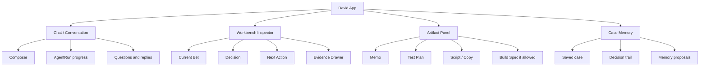

# MVP UX Spec

## Purpose

This file defines how a founder actually works with David in the MVP.

It is not a visual-style document and not a landing-page spec. It defines the product interaction contract for the AI PM coworker:

```text
free-form founder input
-> visible AgentRun progress
-> current Bet
-> evidence and risk
-> decision
-> next action
-> useful artifact
-> memory update
```

The UX should make David feel like a senior PM coworker with a structured workbench, not a generic chatbot, rigid wizard, PRD generator, or dashboard-first SaaS.

## Source Relationship

| File | Role |
|---|---|
| `00_product_principles.md` | Product identity and north star. |
| `01_target_users.md` | Target users and founder constraints. |
| `02_user_scenarios.md` | Real user situations that drive UX entry points. |
| `03_pm_reasoning_protocol.md` | Hidden PM reasoning loop. |
| `04_bet_model.md` | What the UI must help frame and inspect. |
| `05_evidence_model.md` | What the UI must expose for trust and provenance. |
| `06_decision_policy.md` | Decision card, confidence, and PRD gate behavior. |
| `07_agent_workflows.md` | AgentRun, event stream, tools, memory, and artifact runtime. |
| `08_mvp_ux_spec.md` | User-facing interaction model and MVP surfaces. |

Visual references live in:

- `docs/frontend/00_final_visual_direction.md`
- `docs/frontend/01_validation_page_design_spec.md`
- `docs/frontend/02_david_app_design_note.md`

## How This UX Is Derived

This UX is not invented from a blank page. It is derived from:

| Input | UX Consequence |
|---|---|
| Real scenarios in `02_user_scenarios.md` | The entry must accept messy situations, not only clean forms. |
| AgentRun model in `07_agent_workflows.md` | The UI must render progress, tool calls, questions, artifacts, and run controls. |
| Bet/Evidence/Decision specs | The UI must expose the current Bet, evidence strength, decision, PRD gate, and next action. |
| PM principles | The UI must discourage premature PRDs and feature factory behavior. |
| Existing prototype notes | Use chat + workbench + inspector as the starting pattern, but simplify for MVP. |
| RetirePath companion reference | Chat is the main entry; heavy/auditable objects live in a structured workbench. |

## UX Thesis

David MVP is:

```text
chat-first PM coworker
+ structured workbench
+ visible evidence
+ one next action
```

David MVP is not:

- a landing page
- a form-only diagnosis tool
- a many-tab product management suite
- a pure chatbot with no persistent objects
- a PRD editor
- a generic multi-agent control room
- an enterprise roadmap dashboard

The user should feel:

```text
I can describe my messy product situation naturally.
David turns it into a Bet, checks evidence, makes a decision, and gives me one concrete next PM action.
I can inspect why it said that.
```

## MVP Scope Rule

For the first productized MVP:

```text
One founder
One case
One active Bet
One active AgentRun
One decision
One next action
One primary artifact
```

This prevents the UI from becoming a complex product OS before the core PM coworker loop is proven.

`One active AgentRun` means one foreground working run for the current case. A long-running task may be `backgrounded`, but the MVP should not allow multiple independent foreground runs competing for the same Bet and decision state.

## Primary Entry Point

Default prompt:

```text
What are we working on?
```

Do not use the default entry:

```text
Start diagnosis
```

Reason:

- David is a PM coworker, not a diagnosis kiosk.
- The user may arrive with an idea, product, link, metric, launch result, weak signal, or PM learning question.
- The agent should infer the mode silently and create the right AgentRun.

### Empty State

The empty state should invite a real situation, not explain features.

Good examples:

```text
Paste an idea, product link, launch result, user complaint, or metric.
David will frame the Bet and decide what matters next.
```

Example prompts:

| Prompt | Scenario |
|---|---|
| "I can build, but I do not know what is worth building." | S1 |
| "I built a prototype, but the value is not clear." | S2 |
| "I launched, but nobody uses it." | S3 |
| "I have visitors but no paid users." | S3/S5 |
| "I need to think like a real PM. What should I do next?" | S6 |

Prompt chips are optional helpers. They must not become fixed routes.

## Product Surfaces

The MVP has four primary surfaces.



### Surface Responsibilities

| Surface | Job | Contains | Must Not Become |
|---|---|---|---|
| Chat | Natural conversation and active AgentRun. | Messages, composer, questions, progress, inline artifacts. | The only place where product state lives. |
| Workbench Inspector | Persistent PM state. | Current Bet, risks, evidence, decision, PRD gate, next action. | A giant dashboard or roadmap app. |
| Artifact Panel | Output workspace. | Memo, test plan, interview script, landing copy, coding prompt if allowed. | A generic document editor. |
| Case Memory | Continuity and audit. | Saved case, memory proposals, decision history, stale assumptions. | A hidden black-box memory store. |

## Layout

### Desktop Layout

Default desktop layout:

```text
Left rail / case list      optional, collapsed by default in MVP
Center chat/work area      primary
Right workbench inspector  persistent
Artifact panel             inline or slide-over when selected
```

MVP desktop should prioritize:

1. Center chat and active run.
2. Right inspector with current Bet and decision.
3. Evidence drawer on demand.
4. Artifact panel only when an artifact exists.

### Mobile Layout

Mobile uses stacked surfaces:

```text
Chat
-> Current decision card
-> Current Bet
-> Evidence drawer
-> Artifact
```

Rules:

- The composer stays accessible.
- The current decision and next action should appear before dense evidence.
- Evidence details should be collapsible.
- Do not require side-by-side panels on mobile.

## Chat UX

Chat is the main working surface.

### Composer

The composer accepts:

- text
- product URL
- competitor URL
- social post or complaint link
- screenshot or image
- metric snippet
- copied notes
- evidence link
- "I don't know" style uncertainty

Composer actions:

| Action | Meaning |
|---|---|
| Send | Create or resume AgentRun. |
| Attach | Add screenshot, note, metric, or file. |
| Reference case | Ask about existing Bet/evidence/decision. |
| Stop | Cancel current run before next checkpoint. |
| Resume | Continue a waiting/backgrounded run. |

### Chat Message Rules

David should not answer every message as a long essay.

Preferred response shapes:

- one clarifying question when necessary
- short PM judgment when enough context exists
- visible AgentRun progress for non-trivial work
- artifact when useful
- decision card when a decision is made

Avoid:

- pretending to have run research when it has not
- explaining the whole PM theory unless user asks
- asking many questions before giving any useful structure
- generating a PRD when the Bet is not build-ready

## AgentRun UX

For non-trivial work, show an AgentRun card.

### AgentRun Card

Required fields:

| Field | Meaning |
|---|---|
| Run title | What David is working on. |
| Status | Backend enum: `running`, `waiting_for_user`, `completed`, `failed`, `cancelled`, `interrupted`, `backgrounded`. |
| Current step | Human-readable step label. |
| Todos | 2-5 visible steps max. |
| Controls | Stop, background, resume, retry when relevant. |
| Output preview | Latest useful artifact, decision, or question. |

User-facing labels may be simpler than backend enums:

| Backend Status | User Label |
|---|---|
| `running` | Working |
| `waiting_for_user` | Needs your input |
| `completed` | Done |
| `failed` | Failed |
| `cancelled` | Stopped |
| `interrupted` | Replaced by newer request |
| `backgrounded` | Running in background |

Example step labels:

```text
Framing the Bet
Checking payment evidence
Inspecting the product page
Mapping value/usability/feasibility/viability risk
Preparing the next validation test
```

Do not show fake progress for simple responses.

### Event Stream Rendering

Map `07_agent_workflows.md` events to UI.

| AgentRunEvent | UI Rendering |
|---|---|
| `run.started` | Create run card with short objective. |
| `run.resumed` | Restore prior run state and show "Resumed". |
| `step.started` | Update current step label. |
| `todo.updated` | Update checklist. |
| `tool.started` | Show compact public tool label. |
| `tool.progress` | Show progress note only for long work. |
| `tool.completed` | Show short observation summary. |
| `tool.failed` | Show tool failure, recoverability, and retry/fallback if available. |
| `permission.requested` | Show approval card with reason and options. |
| `state.patch.proposed` | Show subtle "Bet/evidence updated" notice if user-visible. |
| `state.patch.applied` | Update the affected workbench panel from backend state. |
| `evidence.updated` | Add evidence row and optional drawer badge. |
| `artifact.emitted` | Open artifact preview or show inline card. |
| `decision.emitted` | Update decision card and next action. |
| `memory.updated` | Show memory proposal or saved-memory notice. |
| `run.waiting_for_user` | Show question card and keep composer active. |
| `run.completed` | Collapse progress; keep decision/artifact visible. |
| `run.failed` | Show recoverable error and retry path. |
| `run.cancelled` | Mark stopped; do not create long-term memory by default. |
| `run.interrupted` | Explain newer request superseded old run. |
| `run.backgrounded` | Show background state and return affordance. |

## Workbench Inspector

The Workbench Inspector is the persistent right-side PM state.

Default stack:

```text
Current Bet
Decision
Next Action
Evidence
Artifacts
Memory
```

The inspector should update from AgentRun events, not require the user to manually manage fields.

Hard rule:

```text
Frontend renders backend state and AgentRun events.
Frontend never computes PM judgment, confidence, PRD gate, or evidence strength.
```

## Current Bet Panel

Purpose: make the thing being judged explicit.

Required fields:

| Field | UX |
|---|---|
| Target user | Specific segment; show warning if vague. |
| Situation | When the problem appears. |
| Job/problem | What progress the user wants. |
| Solution guess | Current proposed solution. |
| Business outcome | Payment, retention, conversion, revenue, or learning outcome. |
| Readiness | `raw`, `framed`, `test_ready`, `build_ready`, `launch_learning`. |
| Riskiest assumption | One sentence. |

Actions:

| Action | Rule |
|---|---|
| Edit Bet | Allowed, but changes should create state patch and preserve prior version. |
| Ask David to refine | Creates AgentRun. |
| View linked evidence | Opens Evidence drawer. |
| Create test | Allowed when readiness is `framed` or `test_ready`. |

Empty state:

```text
No Bet framed yet.
Tell David what you are building, who it is for, and what decision you need.
```

## Decision Card

Purpose: show the current PM judgment.

Required fields:

| Field | UX |
|---|---|
| Decision | `build`, `test`, `kill`, `narrow`, `wait`, or `iterate`. |
| Confidence | `low`, `medium`, or `high`. |
| PRD Gate | `allowed` or `blocked`. |
| Why | 1-3 concrete reasons. |
| What would change this | Specific evidence or result. |
| Last updated | Timestamp/run link. |

Decision display rules:

- `build`: show scope and instrumentation reminder.
- `test`: show riskiest assumption and test CTA.
- `kill`: show disconfirming evidence and learning summary.
- `narrow`: show what must become more specific.
- `wait`: show recheck trigger.
- `iterate`: show bottleneck and experiment.

PRD gate behavior:

| Gate | UI |
|---|---|
| `allowed` | Enable build-spec/coding-prompt artifact. |
| `blocked` | Disable PRD CTA; show missing evidence and strongest next test. |

`PRD Gate` is strictly:

```text
allowed | blocked
```

`override_build` is not a PRD gate state. It is a separate founder action when the user chooses to build despite a blocked gate.

### Override Build UX

If the user asks to build while PRD gate is blocked, show an explicit approval card.

Required fields:

| Field | Meaning |
|---|---|
| Current gate | Must remain `blocked`. |
| Accepted risk | Value, usability, feasibility, viability, or trust risk the founder accepts. |
| Missing evidence | What is still unresolved. |
| Smallest reversible scope | The smallest learning prototype David is willing to help define. |
| Learning metric | What must be measured. |
| Review trigger | When to stop and reassess. |
| Approval | User must explicitly confirm override. |

Allowed output after override:

```text
learning prototype brief
```

Still forbidden:

```text
full PRD
broad roadmap
scale plan
unqualified coding-agent spec
```

## Next Action Card

Purpose: make the product immediately useful.

Required fields:

| Field | Meaning |
|---|---|
| Action title | One concrete action. |
| Owner | `founder`, `David`, or `founder + David`. |
| Timeline | Example: tonight, 48 hours, 7 days. |
| Success rule | What result is enough. |
| Kill/iterate rule | What result changes the decision. |
| Artifact link | Test plan, script, copy, or spec. |

MVP rule:

```text
One next action beats a list of ten recommendations.
```

## Evidence Drawer

Purpose: make David's judgment trustworthy and auditable.

Default view:

| Column | Meaning |
|---|---|
| Claim | What this evidence supports or challenges. |
| Source | Platform, user, URL, metric, file, or artifact. |
| Strength | `none`, `weak`, `medium`, `strong`, `very_strong`. |
| Confidence | `low`, `medium`, `high`. |
| Recency | Captured/observed time. |

Detail view:

- raw excerpt or metric
- source URL/file/path
- source type
- user segment
- observed behavior
- WTP hint
- downgrade reasons
- contradiction
- linked assumption
- linked decision

Rules:

- LLM reasoning alone should never appear as evidence.
- Synthetic or missing evidence should be marked as `none` or shown as an evidence gap, not proof.
- Evidence rows should link back to source whenever possible.
- Missing evidence should be visible as a gap, not hidden.

Evidence empty state:

```text
No evidence yet.
David can use your notes, product link, complaints, reviews, metrics, or public research to create Evidence Cards.
```

## Artifact UX

Artifacts are concrete PM work outputs. They can appear during the run, not only at the end.

### Artifact Types

| Artifact | When Allowed | UX |
|---|---|---|
| Bet card | After initial framing. | Inline card + inspector update. |
| Evidence report | After evidence search/extraction. | Drawer/report preview. |
| Decision memo | After Decision Record exists. | Artifact panel. |
| Test plan | When decision is `test` or `iterate`. | Editable/copyable checklist. |
| Interview script | When user needs customer learning. | Copy-ready script with Mom Test warnings. |
| Outreach copy | When user needs market-facing test. | Channel-specific drafts. |
| Landing copy | When testing payment/positioning. | Copy blocks, not full website builder. |
| Feature cut list | When mid-build scope is unclear. | Feature table with keep/cut/test. |
| Build spec | Only when PRD gate allowed. | Evidence-backed scope and acceptance criteria. |
| Coding-agent prompt | Only when build spec allowed or override learning prototype. | Copy/export action. |

### Artifact Rules

- Artifacts must show which Bet, Evidence, and Decision they depend on.
- Artifacts should be copyable.
- Artifacts can be revised through chat.
- Build artifacts must show PRD gate status.
- If the artifact is based on weak evidence, show that clearly.

## Memory UX

Memory should be visible enough to build trust, but not dominate the MVP.

### Memory Surfaces

| Surface | UX |
|---|---|
| Memory proposal card | "David wants to remember..." with accept/reject/edit when needed. |
| Case memory drawer | Shows founder capability, product context, prior decisions, evidence, outcomes. |
| Memory badge | Indicates when prior context affected the current answer. |
| Memory settings | View, edit, reject, delete, or export memory. |

### Memory Rules In UI

- Do not silently store sensitive data.
- Show sensitive memory approval when needed.
- Let user correct remembered facts.
- Mark stale memory.
- Show when a decision used prior memory.

Example:

```text
I used your saved constraint: 8 hours/week and no existing audience.
```

## Permission And Privacy UX

David should ask for permission at the moment of action.

Permission cards must include:

| Field | Meaning |
|---|---|
| Operation | What David wants to do. |
| Why | Why this matters for the PM decision. |
| Data used | What will be read/sent/stored. |
| Scope | One time, session, or persistent. |
| Options | Grant once, grant session, deny. |

Permissions required for:

- external write actions
- connecting private accounts
- storing sensitive memory
- accessing private analytics/customer data
- running background tasks
- payment/purchase actions
- blocked-gate coding-agent handoff or override learning prototype

## Scenario UX Mapping

| Scenario | User Says | UI Should Do |
|---|---|---|
| S1 Can build, no direction | "I don't know what to build." | Chat frames candidate Bet; inspector shows raw/framed Bet; next action is complaint/search/payment evidence test. |
| S2 Mid-build value unclear | "I built half of this but value/IA is unclear." | Product review mode; Bet panel highlights vague value; artifact may be feature cut list or prototype test plan. |
| S3 Built but nobody uses/pays | "I launched but no users." | Ask for URL/traffic/traction; decision card likely test/iterate/narrow/kill; evidence drawer separates vanity from behavior. |
| S4 GTM freeze | "I can build but avoid launching." | Next action becomes concrete outreach/payment test; artifact is copy/script/checklist. |
| S5 Weak signal | "Someone visited/commented but I don't know what it means." | Evidence drawer creates one weak/medium evidence card; next action asks for repeated pattern or follow-up. |
| S6 PM learner | "What would a real PM do?" | David gives judgment first, then short PM principle; artifact can be decision rationale or tradeoff memo. |

## Interaction States

| State | UI Behavior |
|---|---|
| Empty | Ask "What are we working on?" and show examples. |
| Drafting | User is typing/attaching; inspector remains stable. |
| Running | Show AgentRun card and step progress. |
| Waiting for user | Backend state `waiting_for_user`; show question card; composer remains active. |
| Permission needed | Show permission card; block only that action. |
| Evidence added | Update evidence drawer and badge. |
| Decision emitted | Update decision card and next action. |
| Artifact ready | Show artifact preview and open/copy actions. |
| Completed | Collapse run progress; keep final state visible. |
| Failed | Explain failure and offer retry or manual fallback. |
| Cancelled | Stop run; do not create durable memory by default. |
| Interrupted | Explain that a newer request replaced the prior run. |
| Backgrounded | Show background indicator and return control. |

## UI Events

The frontend sends user intent, not PM judgment.

Minimum UI events:

| Event | Payload | Backend Effect |
|---|---|---|
| `conversation.message_submitted` | text, attachments, target case/run | create/resume AgentRun |
| `conversation.attachment_added` | attachment metadata | link local artifact to run/case |
| `agent_run.cancel_requested` | run ID | cancel before next checkpoint |
| `agent_run.resume_requested` | run ID | resume `waiting_for_user`/backgrounded run |
| `agent_run.background_requested` | run ID | keep long work in background |
| `agent_run.permission_decision` | request ID, decision | continue or block tool |
| `artifact.action_clicked` | artifact ID, action ID | copy, revise, open, continue, export |
| `bet.edit_submitted` | patch | propose Bet state patch |
| `evidence.item_selected` | evidence ID | open evidence detail |
| `memory.decision_submitted` | memory update ID, accept/reject/edit | apply or reject memory |

Rules:

- Frontend does not decide `build/test/kill/narrow/wait/iterate`.
- Frontend does not bypass PRD gate.
- Frontend does not mutate canonical state without a validated backend state patch.

## Navigation

MVP navigation should be shallow.

Recommended sections:

| Section | Purpose |
|---|---|
| Current Case | Main chat/workbench. |
| Evidence | Expanded ledger view. |
| Artifacts | Reports, scripts, tests, specs. |
| Memory / Cases | Saved cases and decision history. |
| Settings | Language, privacy, data, integrations. |

These are lenses on the same case, not separate products.

Do not create top-level tabs for:

- idea generator
- PRD generator
- roadmap
- agents
- market intelligence
- course/learning

Those may exist as actions or artifacts inside the coworker flow.

## Visual And Motion Constraints

High-level visual direction should align with the app notes:

```text
Precision coworker console
+ calm operational workbench
+ functional color for risk/evidence/decision
```

Rules:

- No purple AI gradients.
- No decorative AI robot/brain imagery.
- No giant marketing hero inside the app.
- Use color for state: strong evidence, risk, blocked gate, selected object.
- Keep panels dense but readable.
- Motion should explain state change, not decorate.

Allowed motion:

- evidence row added
- step moves pending -> running -> done
- decision card updates
- drawer opens/closes
- artifact emitted

Avoid:

- constant animated hero
- shimmer/rainbow buttons
- confetti
- fake typing delays for serious work

## Accessibility And Responsiveness

Minimum rules:

- All core actions keyboard accessible.
- Composer and send/stop/resume controls have clear focus states.
- Decision, confidence, and PRD gate cannot rely on color alone.
- Evidence strength uses label + color.
- Mobile order prioritizes decision and next action before dense tables.
- Text inside cards/buttons must not truncate critical decision labels.

## MVP Non-Goals

Do not build in MVP:

- full multi-project workspace
- complex dashboard analytics
- enterprise roadmap/ticketing workflow
- autonomous posting/outreach
- multi-agent control room
- visual website builder
- full document editor
- team collaboration and permissions
- marketplace of PM frameworks
- automatic coding handoff when PRD gate is blocked

## UX Acceptance Criteria

The MVP UX is acceptable when a user can:

1. Enter a messy product situation in natural language.
2. See David create or refine a current Bet.
3. See what David is doing during a non-trivial AgentRun.
4. Answer one decision-changing question when needed.
5. Inspect evidence and understand whether it is strong or weak.
6. See a build/test/kill/narrow/wait/iterate decision.
7. Understand why PRD/spec is allowed or blocked.
8. Receive one concrete next action.
9. Open/copy a useful artifact.
10. See or control what David remembers.

## Source Notes

- `docs/specs/02_user_scenarios.md`
- `docs/specs/03_pm_reasoning_protocol.md`
- `docs/specs/04_bet_model.md`
- `docs/specs/05_evidence_model.md`
- `docs/specs/06_decision_policy.md`
- `docs/specs/07_agent_workflows.md`
- `docs/frontend/00_final_visual_direction.md`
- `docs/frontend/02_david_app_design_note.md`
- RetirePath frontend-agent contract: `/Users/bytedance/Desktop/Work/RetirePath/spec/architecture/frontend_agent_contract.md`
- RetirePath UX references: `/Users/bytedance/Desktop/Work/RetirePath/spec/ux/information_architecture.md`, `/Users/bytedance/Desktop/Work/RetirePath/spec/ux/ux.md`
