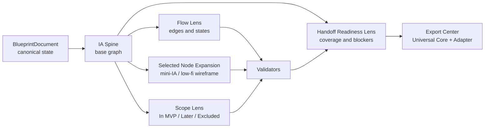

# 02A — Canvas Decision Brief

> 状态：Pre-Spec decision brief  
> 目的：在编写 `02_canvas_interaction_spec.md` 前，冻结已有证据支持的交互原则，隔离仍需验证的产品假设。  
> 边界：本文件不规定最终布局、组件、尺寸、手势、动画参数、zoom threshold 或实现技术。

## 0. Inputs And Decision Status

本 Brief 只综合以下已审查输入：

- [`08_canvas_comprehension_research.md`](research/01-contract-gap-research/08_canvas_comprehension_research.md)
- [`11_patch_proposal_for_01.md`](research/01-contract-gap-research/11_patch_proposal_for_01.md)
- [`12_inputs_for_future_specs.md`](research/01-contract-gap-research/12_inputs_for_future_specs.md)
- [`13_critic_review.md`](research/01-contract-gap-research/13_critic_review.md)
- [`14_shared_vocabulary_resolution.md`](research/01-contract-gap-research/14_shared_vocabulary_resolution.md)
- [`16_machine_audit.md`](research/01-contract-gap-research/16_machine_audit.md)

| Label | Meaning in this document |
|---|---|
| **Contract invariant** | 已由 Mode B product/agent contract 约束；未来 Spec 必须遵守。 |
| **Evidence-backed principle** | 有 authoritative/primary evidence 支持的一般原则；尚未证明对 David 用户有效。 |
| **Provisional recommendation** | 当前最合理的 David-specific design choice；可进入 prototype，但不能伪装成已验证规则。 |
| **Validation required** | 必须由目标用户、可点击 prototype 或 downstream execution 决定。 |

Critic 最终结论为 **PASS，P0=0，P1=0**。这表示 Research Pack 内部合同一致，并不表示 Canvas UX 已经过用户验证。

## 1. Evidence-Backed Canvas Interaction Principles

1. **One canonical state, multiple projections.** Canvas、report、diff 与 handoff 都读取同一 `BlueprintDocument`；它们不能维护互相分叉的产品事实。**Contract invariant.**
2. **Overview first, details on demand, with recovery.** 用户应能先理解整体，再过滤、选择、展开，并随时回到 overview/history。**Evidence-backed principle.**
3. **Representation follows the task.** Hierarchy、grouping、path 和 change location 适合图形；rationale、assumption、evidence、limitation 和 acceptance criteria 适合结构化文字。**Evidence-backed principle.**
4. **Progressive disclosure must preserve task context.** 低频细节可以折叠，但 active target、why、impact 与 available action 不应被拆散到难以关联的位置。**Evidence-backed principle.**
5. **Identity survives every view.** 同一 node 在 IA、Flow、Wireframe、Scope、Diff 与 Handoff 中保持相同 canonical ID。**Contract invariant.**
6. **Provenance is inspectable and orthogonal.** `KnowledgeStatus`、`BasisType`、`LifecycleStatus` 与 `Confidence` 分开表达；颜色不能是唯一编码。**Contract invariant + evidence-backed accessibility principle.**
7. **Consequential changes are inspectable before mutation.** Structure Diff 必须保留 context、before/after、cascade impact 和 decision action；动画不能替代静态可检查状态。**Contract invariant + evidence-backed principle.**
8. **Correction is cheaper than restating context.** Chat correction、Canvas selection 和 Decision target 必须通过 canonical reference 联动。**Evidence-backed HAI direction; exact interaction provisional.**
9. **Critical conditions survive filtering.** Locked constraint、Blocker、core-path break 和 blocking Unknown 不能因 lens、zoom 或 focus 被静默隐藏。**Contract invariant.**
10. **Readiness is derived, not declared.** Handoff readiness 来自 validator、coverage 和 execution evidence；模型不能凭语气或视觉完成度写入 `ready`。**Contract invariant.**

## 2. Provisional Interaction Hypotheses

以下方向可进入 prototype，但尚不能写成最终 UX MUST：

| Hypothesis | Current recommendation | Why still provisional |
|---|---|---|
| Canvas evolution | Stable IA base + progressively revealed lenses，优先于每阶段切换一张独立画布 | 尚未与 staged morph / separated artifacts 做目标用户对照 |
| Surface responsibilities | Conversation 负责输入与澄清；Canvas 负责结构；Decision surface 负责判断、diff 与控制 | 职责合理，但固定三栏、drawer 或 floating panel 未验证 |
| First proposal | 在足够 context 后尽早给可纠正结构 hypothesis，而不是继续长表单提问 | “足够”与 1/3/5 questions 的质量成本未校准 |
| Overlay load | 同时只突出一个 primary analytical lens；critical warnings 例外 | 可能降低过载，但尚无 David task outcome evidence |
| Wireframe placement | 只展开 selected node 的 local mini-IA/wireframe，并保留 IA/Flow context | 专业依据成立，具体展开方式和并列数量未验证 |
| Focus model | Selection-driven、non-distorting focus；保留 ancestors、children 和 core-flow neighbors | 需要与 plain pan/zoom 和 overview+detail 比较 |
| Status disclosure | Baseline 显示少量核心状态，完整 provenance/evidence 按需展开 | 可见状态是 3、5 还是更多仍未知 |
| Diff composition | Operation summary + in-place highlight + on-demand before/after | 仍需与 side-by-side、overlay/animation 比较 |
| Layout stability | Canonical identity 稳定；局部 change 尽量不触发全图大幅重排 | “mental map preservation”效果依任务和图规模而异 |

## 3. Decisions Requiring User Or Prototype Validation

以下问题不能由 desktop research 结案：

1. 用户能否自然理解 `Context → Intent → Objects → IA → Flow → Wireframe → Scope → Handoff` 是同一 Blueprint 的演化，而不是线性完成度。
2. Stable Canvas + lenses 是否优于 staged morph 或分阶段 artifacts。
3. Semantic Zoom 是否比 geometric zoom + explicit expand 更准确、更易发现且更可访问。
4. Focus、overview+detail 与普通 pan/zoom 哪种最能降低 lostness。
5. 用户是否正确理解 Confirmed / Inferred / Unknown，而不会把 Confirmed 误解为市场验证。
6. 哪种 Structure Diff 最少产生漏看 cascade、错误批准和错误 target。
7. IA node 内联 Wireframe 是否保持结构理解，还是 separate preview 更清楚。
8. Canvas 在 small/medium/large/stress Blueprint 下的 overload breakpoint。
9. Conversation、Canvas、Decision surface 的布局和切换成本。
10. Keyboard、screen reader、reduced motion 和窄屏的等价操作路径。

这些测试必须记录 comprehension、wrong-target action、correction completeness、wrong approval、lostness、task success 和 workload，不能只测速度或主观喜欢。

## 4. Relationship Between IA, Flow, Wireframe, Scope And Handoff

### 4.1 Recommended model



### 4.2 Layer responsibilities

| Layer | Role | Must not become |
|---|---|---|
| **IA Spine** | Base graph：what exists、where it belongs、how users locate it | 独立 sitemap page 或自由白板 |
| **Flow Lens** | 在同一 nodes 上显示 entry、trigger、transition、alternate/error/recovery | 第二套 disconnected flowchart |
| **Wireframe Expansion** | 展开 selected node 的 information/action/state arrangement | 全局 wireframe editor 或独立 canonical model |
| **Scope Lens** | 对 canonical targets 标记 In MVP / Later / Excluded、dependency 与 no-go | 独立 feature backlog dashboard |
| **Handoff Readiness Lens** | 显示 artifact coverage、Blocker、AC、dependency 与 export eligibility | 模型自报完成的进度条 |
| **Export Center** | 将同一 Blueprint 编译为 Universal Core 和 agent adapter | 复制一份新的产品事实或自动生成代码 |

Flow、Wireframe、Scope、Acceptance Criteria 与 Handoff 必须通过 canonical node/flow/state IDs 连接。任何 structural mutation 都先形成 `ChangeSet`，再经过 schema、constraint、autonomy policy 和 validator，最后才由 reducer 更新 canonical state。

## 5. Recommended Semantic Zoom Model

### 5.1 Decision

**Provisional recommendation:** 采用三层 semantic representation 作为 prototype candidate；MVP baseline 仍是 geometric pan/zoom + explicit lens/expand controls。Semantic Zoom 只有在测试胜出后才成为默认。

| Semantic level | Primary question | Visible representation | Preserved safety/context |
|---|---|---|---|
| **S0 — Blueprint Overview** | 产品有哪些主要空间，核心路径和风险在哪里？ | groups、top-level nodes、core path、selection location、aggregated critical warnings | locked/blocker/unknown summary；selected-node location |
| **S1 — Structure Working View** | 当前 IA 如何组织，哪些关系和状态重要？ | node labels/types、parent-child、selected relations、active lens markers | canonical ID、provenance baseline、ancestor path |
| **S2 — Node Detail** | 该 node 如何承载信息、动作、state 与 local flow？ | selected node mini-IA/wireframe、incoming/outgoing flow、decision context | parent/ancestors、core neighbors、scope/blocker |

### 5.2 Interaction constraints

- Mouse wheel/pinch 默认只执行 geometric zoom；不得在无提示时突然改变产品语义。
- Semantic level change 必须有 visible level indicator，并提供 explicit `Overview / Structure / Node Detail` alternative。
- 进入 S2 需要 selection 或 explicit expand；不能只因 zoom proximity 自动打开复杂 Wireframe。
- Zoom 改变 projection，不改变 canonical state、scope、approval 或 validation。
- Critical warnings 在 S0 聚合、在 S1/S2 可定位；不能因抽象层级消失。
- Keyboard、screen reader 和 reduced-motion 路径必须能达到等价 semantic level。

### 5.3 Promotion gate

只有当 Semantic Zoom 相比 explicit expand 在 task success、representation awareness、return-to-overview、lostness 和 accessibility 上有净收益，才允许进入最终默认交互。

## 6. Recommended 2.5D Semantic Depth Model

### 6.1 Decision

**2.5D 不进入 MVP core interaction。** 若 prototype 需要表达 focus 与 layer priority，只允许离散、受控、无透视畸变的 semantic depth；不得引入 3D camera、fisheye、自由旋转或空间物理效果。

| Depth | Semantic meaning | Candidate treatment |
|---|---|---|
| **D0 — Base plane** | IA Spine 与未选中 context | neutral plane，稳定位置 |
| **D1 — Active lens** | 当前 Flow / Scope / Handoff projection | restrained overlay，不遮蔽 node identity |
| **D2 — Focus** | selected or expanded node | subtle lift/z-index；保留与 base 的连接 |
| **D3 — Decision/change** | active Diff、approval 或 blocking issue | highest inspectable layer；必须可关闭并回到 target |

Constraints：

- Depth 只表达 interaction priority，不表达 truth、confidence、validation、scope 或 severity。
- 同一 semantic role 使用稳定 depth；不得因动画随机换层。
- 不允许 perspective distortion、不可读 overlap 或被遮挡的 required action。
- Reduced motion 下仍以边框、label、ordering 表达等价层级。
- P0 最多使用普通 z-index/selection lift；完整 2.5D comparison 必须等到明确发现 2D failure 后再测试。

## 7. Recommended Node Interaction Model

### 7.1 Core state machine

```text
idle
→ hover / keyboard focus
→ selected
→ inspect or expand
→ propose correction/change
→ preview Structure Diff
→ policy decision
→ apply / approve / reject / defer / research
→ validate and update projection
```

### 7.2 Recommended behaviors

| Interaction | Result | Boundary |
|---|---|---|
| Hover / keyboard focus | Lightweight label/type/status preview | 不加载完整 evidence 或改变 selection |
| Single select | 同步 Canvas、Conversation reference 和 Decision target | 只更新 view state |
| Inspect | 显示 purpose、rationale、provenance、scope、dependencies、validation | 不复制 node state |
| Explicit expand | 展开该 node 的 mini-IA/wireframe 与 local flow | 默认只展开一个 active node；数量待测试 |
| Trace path | 突出 predecessor、successor、error/recovery 与 entry | 不把 secondary edges 全部常驻 |
| Correct / rename / move / scope change | 创建 proposal 和 `ChangeSet` | 不允许 direct silent mutation |
| Approve / reject / edit / undo | 交给 Autonomy policy 与 StateReducer | UI control 不能绕过 lock、risk 或 validator |
| Collapse / reset | 恢复 structure/overview，同时保留 canonical detail data | collapse 不等于删除 |

### 7.3 Explicit non-goals

- Canvas 不是 Figma、Miro 或 arbitrary node graph editor。
- Node drag 若被允许，只能先作为 local layout preference；改变 hierarchy 必须通过 explicit structural operation。
- Double-click、hidden gesture 或 zoom-only discovery 不能成为唯一关键路径。
- Inline editing 也必须产生 auditable ChangeSet，而不是直接覆盖 approved state。

## 8. Recommended Lens Composer

### 8.1 Composition model

```text
Base: IA Spine (always present)
+ one Primary Lens
+ optional Filters
+ persistent Safety Exceptions
+ selected-node Detail Expansion
```

| Composer part | MVP choices | Rule |
|---|---|---|
| **Base** | IA Structure | 始终存在，不可替换为另一套 graph |
| **Primary Lens** | Flow / Scope / Handoff Readiness / Structure Diff | 默认一次只突出一个 |
| **Filters** | core path、scope status、provenance status、role、validation state | 只改变 projection；可 reset |
| **Safety Exceptions** | Locked、Blocker、blocking Unknown、core-flow break | 永不被 filter 静默移除 |
| **Detail Expansion** | selected node mini-IA/wireframe | 局部叠加，不作为全局 lens |

### 8.2 Recommended presets

- **Structure:** IA only + provenance baseline.
- **Core Flow:** IA + selected/core flow edges and applicable states.
- **Scope Review:** IA + scope status、dependency/no-go markers and review list.
- **Handoff Review:** IA + readiness coverage、Blockers、missing AC/dependencies and Export entry.
- **Change Review:** affected structure + Structure Diff + cascade impact.

### 8.3 Constraints

- Lens state 是 ephemeral view state，不写入 product truth。
- Preset 不等于 disconnected page/editor；selection 和 viewport context 应尽量连续。
- 不在 MVP 提供任意 overlay 组合、保存复杂 custom lenses 或同时高亮全部 dimensions。
- Validation 可以作为 cross-cutting issue markers；不能变成模糊总分或独立 KPI dashboard。

## 9. Required Structure-Diff And Approval Behaviors

### 9.1 Minimum inspectable ChangeSet

每个 consequential change 必须提供：

```text
operation: add | move | rename | reorder | merge | split | archive | scope_change
target canonical ID and label
before / after
reason
knowledge/basis/lifecycle provenance
confidence
affected Flow / Wireframe / Scope / AC / Handoff refs
constraint and core-path impact
autonomy decision
available control
recovery / Undo scope and persistence
```

### 9.2 Presentation requirements

- 使用文字 operation 与非颜色编码；颜色只作为冗余强调。
- changed target 与 affected-but-unchanged references 必须区分。
- 保留 ancestor/parent/path context，不能只显示孤立 changed node。
- 提供静态、可停留、可复查的 before/after；动画只能辅助 correspondence。
- Candidate comparison 与 before/after diff 是两种任务，不得混成一个多状态 overlay。
- Invalid patch、locked conflict 或 active Blocker 不得先 mutation 再通知用户。

### 9.3 Approval behavior by policy

| AutonomyDecision | Canvas behavior |
|---|---|
| `AUTO_APPLY` | 应用 deterministic low-risk change；显示 concise summary/provenance。 |
| `APPLY_WITH_UNDO` | 原子应用；立即显示 affected refs、Undo control、scope 和 persistence。 |
| `PROPOSE_FOR_APPROVAL` | 保持 canonical state 不变；展示 diff、alternatives、cascade、Approve/Edit/Reject。 |
| `ASK_USER` | 聚焦一个 blocking user-owned fact；说明它改变哪个 decision。 |
| `DEFER_AS_ASSUMPTION` | 显示 assumption、fallback、confidence 与 review trigger；继续安全工作。 |
| `RESEARCH_OR_TEST` | 显示 evidence gap、method、threshold 和会改变的 decision；不要求偏好式批准。 |

Approval、Undo 与 execution permission 必须使用 versioned shared vocabulary；UI 不得创建第二套 action enum。

## 10. MVP Interaction Boundary

### 10.1 Include in MVP

1. One canonical IA Canvas with stable IDs.
2. Geometric pan/zoom、zoom-to-selection、fit/reset 和 keyboard navigation.
3. Node selection、inspection、explicit local expansion/collapse.
4. One Primary Lens at a time：Flow、Scope、Handoff Readiness 或 Diff.
5. Baseline provenance/status with non-color encoding and detail-on-demand.
6. Structure Diff、Approve/Edit/Reject 与 complete Undo behavior.
7. Locked/Blocker/core-path safety visibility.
8. Selected-node low-fi mini-IA/wireframe preview，非自由编辑器。
9. Text/programmatic alternatives for graph relationships and status.
10. Instrumentation for comprehension、correction、approval、Undo、lostness and lens use.

### 10.2 Exclude from MVP

- Semantic Zoom as an automatic default；只可作为 experiment flag/prototype variant。
- 2.5D、fisheye、true 3D、perspective navigation 或 decorative depth system。
- Multiple full wireframes expanded across the graph by default.
- Arbitrary overlay composition、saved custom lenses 或 dashboard KPI wall。
- Freeform wireframe editing、no-code builder behavior、automatic code generation。
- Direct structural mutation through drag/drop without ChangeSet and policy。
- Complex graph animation、animation-only diff 或 token-level reasoning visualization。
- Mobile-first Canvas、collaboration、multi-user presence 和 unrestricted whiteboard behavior。

## 11. Risks And Anti-Patterns

| Risk / anti-pattern | Why it is harmful | Guardrail |
|---|---|---|
| Separate IA/Flow/Wireframe/Scope editors | 产生 disconnected states 和 ID drift | One canonical state + projections |
| Chat-first product | 结构埋在 conversation history，难以纠错和审计 | Canvas owns current structure |
| “Everything graph” | 图承担长文、evidence、AC 和所有 overlays，快速过载 | Representation-task split + one primary lens |
| Stage-completion theater | 用户把 reasoning coverage 误解为质量或验证完成 | Maturity/provenance，不使用模糊总进度分 |
| Semantic Zoom surprise | 滚轮触发隐藏的语义切换，用户误以为内容消失 | Visible levels + explicit alternatives |
| Decorative 2.5D | 增加 occlusion、distortion 和 AI-demo 感 | Flat MVP；depth only after measured 2D failure |
| Status color soup | Provenance、confidence、scope、severity 混成红黄绿 | Orthogonal vocabulary + text/icon/pattern |
| Animation-only diff | 用户错过 change、无法停留复核 | Static inspectable diff first |
| Silent structural mutation | Agent 越权，cascade 无法恢复 | ChangeSet → policy → validator → reducer |
| Direct drag equals hierarchy edit | Layout gesture意外改变 product truth | Layout preference 与 structural operation 分离 |
| Hidden Blocker under filter | 视觉简洁掩盖不可交付状态 | Persistent safety exception |
| Handoff readiness as AI opinion | 漂亮界面替代 artifact/validator/execution evidence | Derived readiness only |
| Wireframe fidelity creep | 过早变成 UI generator，遮蔽 IA/flow 风险 | Low-fi selected-node expansion only |
| Fixed graph thresholds from literature | 外部 node/edge 数字不能迁移到 David | Real Gold cases + stress prototype tests |

## 12. Inputs Required By `02_canvas_interaction_spec.md`

### 12.1 Inputs already ready to consume

The final Canvas Spec may treat these as constraints:

- `BlueprintDocument` as canonical state and all cross-layer canonical ID rules.
- Versioned shared vocabulary for provenance、severity、autonomy and execution permission.
- Conversation / Canvas / Decision / Progress-event responsibility boundaries.
- IA Spine + overlays + selected-node expansion relationship.
- ChangeSet、Structure Diff、approval、Undo and validator ordering.
- Accessibility baseline：non-color semantics、keyboard reachability、text alternative、reduced motion.
- MVP inclusions/exclusions defined in this Brief.
- Existing Gold cases、Autonomy cases and Validator catalog as test fixtures.

### 12.2 Product decisions the final Spec must make

After prototype evidence, `02_canvas_interaction_spec.md` must specify:

1. First-proposal shape and minimum context gate.
2. Exact always-visible vs progressively disclosed information.
3. Actual surface layout and narrow-viewport degradation.
4. Node selection、inspection、expansion、collapse and edit commands.
5. Lens Composer controls、presets、filter reset and safety-exception behavior.
6. Focus/context behavior and graph layout stability.
7. Structure Diff mode、approval controls and Undo visibility.
8. Visible provenance/status subset and evidence drawer behavior.
9. Whether Semantic Zoom is rejected、optional or default after testing.
10. Whether any 2.5D treatment has measured value; otherwise explicitly prohibit it.
11. Keyboard、screen-reader、reduced-motion and non-color interaction contracts.
12. Analytics events and UX acceptance criteria.

### 12.3 Domain data the Spec consumes but does not redefine

Formal ownership belongs to future `03_blueprint_domain_schema.md`:

```text
current projection / maturity
selection canonical ID
IA nodes and navigation placements
Flow edges, states and path applicability
node mini-IA / wireframe readiness
Scope status, dependencies and no-gos
provenance facets and confidence
ChangeSet operations and cascade impacts
AutonomyDecision and approval state
ValidationResult / Severity / readiness dimensions
history version and Undo record
Handoff coverage and export eligibility
```

### 12.4 Required validation before freezing the final Spec

- Evolution comprehension test.
- Chat/Canvas/Decision coordination test.
- Semantic Zoom vs explicit expand comparison.
- Focus/context comparison.
- Provenance comprehension test.
- Structure Diff and wrong-approval test.
- IA + Wireframe readability test.
- Small/medium/large/stress Blueprint overload test.
- Keyboard/screen-reader/reduced-motion accessibility test.

The final Spec may freeze interaction behavior only where these tests establish a clear decision. Where evidence remains inconclusive, it must preserve an explicit fallback rather than convert preference into a product invariant.
