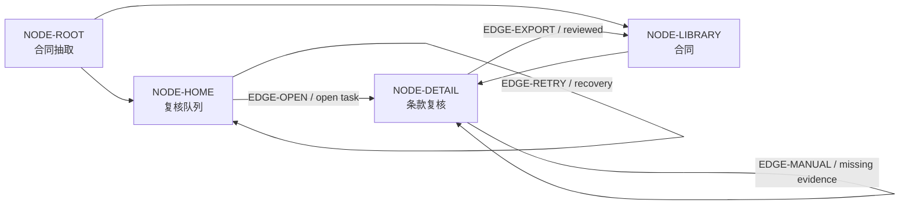

# 02B — Unified Canvas Worked-Case Validation

> 状态：Pre-Spec worked-case validation + executable reference prototype  
> 目的：用一条完整案例检查 IA、Flow 与 Wireframe 能否在同一 Canvas 中共享 identity、context 和 decision。  
> 边界：这是 synthetic expert walkthrough，不是真实用户可用性结论，也不是最终 Canvas Spec。

## 0. Executive Decision

**Structural verdict：可以协作，但有前提。**

IA、Flow 和 Wireframe 可以自然地构成同一张图，前提是：

1. IA 是 base graph；
2. Flow 只引用 IA node/state/action IDs；
3. Wireframe 是 selected node 的局部展开；
4. Flow edge 必须绑定 Wireframe 中可见的 trigger/action；
5. 展开 Wireframe 时仍保留 parent、entry、next state 和 core-path context；
6. 一次只突出一个 primary lens，并只展开一个 active node；
7. 所有结构修改都通过 ChangeSet，而非直接改图。

**Human-comprehension verdict：尚未验证。** 本案例证明 data/interaction model 能闭合，但“用户是否觉得自然”仍需可点击 prototype test。

## 1. Source Case

采用现有 synthetic Gold Case：

| Field | Value |
|---|---|
| Case | `IA-GOLD-003` |
| Product | AI 合同条款抽取与人工复核 |
| Target user | 企业法务运营人员 |
| Core job | AI 预填条款，但导出前必须人工核对关键字段 |
| Platform | Desktop web |
| Locked constraints | 必须人工复核；V1 单文件；不提供法律建议 |
| Source | [`ia_gold_cases_seed.jsonl`](research/01-contract-gap-research/datasets/ia_gold_cases_seed.jsonl) |

选择它的原因：它同时包含 stable object、异步 AI processing、人工 review gate、error/retry、evidence inspection 和最终 export，足以暴露三层协作是否真实闭合。

## 2. Validation Question

```text
Can a legal reviewer:
1. understand where the work lives,
2. follow the end-to-end review flow,
3. inspect and correct one clause inside its node,
4. recover from missing evidence or extraction failure,
5. return to the larger IA without losing orientation,
while IA, Flow and Wireframe remain one canonical model?
```

## 3. Normalized Canonical Model

现有 Gold Case 的方向保留，但为本次 walkthrough 补齐 Flow/State 粒度。以下是 validation projection，不直接回写 Gold seed。

### 3.1 IA Spine

| Node ID | Label | Parent | Purpose |
|---|---|---|---|
| `NODE-ROOT` | 合同抽取 | — | Product root |
| `NODE-HOME` | 复核队列 | `NODE-ROOT` | 看失败、处理中、待复核和可导出任务 |
| `NODE-LIBRARY` | 合同 | `NODE-ROOT` | 稳定合同对象、历史与完成结果 |
| `NODE-DETAIL` | 条款复核 | `NODE-LIBRARY` | 核对字段、原文、状态和审计说明 |

IA 只回答：**什么存在、放在哪里、如何定位。** 它不在 node body 中常驻完整 process 或 screen layout。

### 3.2 Canonical states

| State ID | Owner node | Meaning |
|---|---|---|
| `STATE-QUEUE` | `NODE-HOME` | 队列可浏览 |
| `STATE-PROCESSING` | `NODE-HOME` | AI 正在抽取 |
| `STATE-EXTRACTION-ERROR` | `NODE-HOME` | 抽取失败，可重试 |
| `STATE-REVIEW` | `NODE-DETAIL` | 字段等待人工核对 |
| `STATE-EVIDENCE-MISSING` | `NODE-DETAIL` | 当前字段没有足够原文证据 |
| `STATE-FIELD-CONFIRMED` | `NODE-DETAIL` | 当前字段已确认 |
| `STATE-READY-EXPORT` | `NODE-DETAIL` | 所有必填字段已确认 |
| `STATE-EXPORTED` | `NODE-LIBRARY` | 已复核结果生成并归档 |

### 3.3 Flow overlay

| Edge ID | Source → Target | Trigger | Guard | Result / recovery |
|---|---|---|---|---|
| `EDGE-UPLOAD` | `NODE-HOME → NODE-HOME` | Upload contract | 单文件、格式允许 | `STATE-PROCESSING` |
| `EDGE-RETRY` | `NODE-HOME → NODE-HOME` | Retry extraction | 当前为 extraction error | 回到 `STATE-PROCESSING` |
| `EDGE-OPEN` | `NODE-HOME → NODE-DETAIL` | Open review task | 抽取完成 | `STATE-REVIEW` |
| `EDGE-CONFIRM` | `NODE-DETAIL → NODE-DETAIL` | Confirm field | 有 evidence 或人工说明 | 下一字段或 `STATE-READY-EXPORT` |
| `EDGE-EDIT` | `NODE-DETAIL → NODE-DETAIL` | Edit and explain | Reviewer permission | 保存修订和 audit trail |
| `EDGE-MANUAL` | `NODE-DETAIL → NODE-DETAIL` | Enter manually | Evidence missing | 回到可确认状态 |
| `EDGE-EXPORT` | `NODE-DETAIL → NODE-LIBRARY` | Export reviewed data | 所有必填字段 confirmed | `STATE-EXPORTED` |

Flow 只回答：**用户如何从一个 canonical state 到另一个 state。** Edge 不连接 screen 边框，而是连接 node 内的明确 trigger。

## 4. Unified Canvas Projection

### 4.1 IA + Flow



IA hierarchy 使用稳定实线；active Flow lens 使用有 trigger 的 directed edges。两者共享 node IDs，不复制“复核页”或“合同状态”。

### 4.2 Selected-node Wireframe expansion

当用户选择 `NODE-DETAIL` 并 explicit expand 时，node 局部展开：

```text
┌ NODE-DETAIL · 条款复核 ─────────────────────────────────────────┐
│ Contract A · 7/9 confirmed          Status: Review required      │
├──────────────┬──────────────────────────┬─────────────────────────┤
│ Clause list  │ Extracted value          │ Source document         │
│              │                          │                         │
│ ✓ Parties    │ Termination: 30 days     │ “…thirty (30) days…”    │
│ ● Termination│ Confidence: supporting   │ highlighted source      │
│ ! Liability  │                          │                         │
│ ○ Governing  │ [Confirm] [Edit]         │ [Open full page]        │
│              │ [Cannot determine]       │                         │
├──────────────┴──────────────────────────┴─────────────────────────┤
│ Previous                     Save & next                     Next │
│ Export reviewed data [disabled until all required confirmed]     │
└──────────────────────────────────────────────────────────────────┘
```

Wireframe 只回答：**在 `NODE-DETAIL` 内，用户需要看到什么、做什么、收到什么反馈。**

Action bindings：

| Wireframe control | Flow binding |
|---|---|
| `Confirm` | `EDGE-CONFIRM` |
| `Edit` | `EDGE-EDIT` |
| `Cannot determine` / manual value | `EDGE-MANUAL` |
| `Export reviewed data` | `EDGE-EXPORT` |
| Full-page source | 保持 `NODE-DETAIL`，只改变 local disclosure |

因此 Wireframe 不是另一张独立 screen spec；它是 `NODE-DETAIL` 的 visible local projection。

## 5. End-To-End Walkthrough

### Step 1 — Orient in IA

用户打开 Canvas，看到 `复核队列` 与 `合同` 两个稳定空间。默认不显示完整 Wireframe。

**Validation:** 用户可以先理解 work queue 与 stable contract object 的区别，不需要阅读 Flow 细节。

### Step 2 — Activate Core Flow lens

Flow lens 只突出 `EDGE-OPEN → EDGE-CONFIRM/EDIT → EDGE-EXPORT`，同时保留 IA parent/child。

**Validation:** Flow 没有创建第二套 nodes；用户仍能看见任务最终回到 `合同`。

### Step 3 — Open a review task

用户从 `NODE-HOME` 选择待复核任务，`EDGE-OPEN` 高亮并把 selection 移到 `NODE-DETAIL`。

**Validation:** Canvas、Flow target 和 Decision surface 都引用 `NODE-DETAIL`，不需要在 Chat 中重新寻找对象。

### Step 4 — Expand the selected node

`NODE-DETAIL` 局部展开 Wireframe；Canvas 仍保留 `NODE-LIBRARY` parent、`NODE-HOME` entry 和 `EDGE-EXPORT` next destination。

**Validation:** 详细交互出现，但 global orientation 没有消失。

### Step 5 — Correct an unsafe extraction

用户发现 Liability 没有证据，选择 `Cannot determine`，进入 `STATE-EVIDENCE-MISSING`。Export 保持 disabled，并提供 manual entry / full-page source。

**Validation:** Wireframe error state、Flow recovery 和 locked human-review constraint 同时可见；AI confidence 不能自动跳过 review。

### Step 6 — Complete review and export

全部必填字段 confirmed 后进入 `STATE-READY-EXPORT`。触发 `EDGE-EXPORT`，结果进入 `NODE-LIBRARY / STATE-EXPORTED`。

**Validation:** Final CTA 与 Flow guard 一致，scope/no-go 没有被 Wireframe 绕过。

### Step 7 — Collapse and return

Wireframe collapse 后，`NODE-DETAIL` 恢复抽象 node；`STATE-EXPORTED` 和 audit history 保留在 canonical model。

**Validation:** Collapse 只改变 projection，不删除 detail data 或 history。

## 6. Failure And Recovery Walkthrough

| Failure | What appears in IA/Flow | What appears in Wireframe | Expected recovery |
|---|---|---|---|
| Extraction fails | `NODE-HOME / STATE-EXTRACTION-ERROR`；突出 `EDGE-RETRY` | 不展开复核 Wireframe | Retry，或保留输入并报告 failure |
| Evidence missing | `NODE-DETAIL` 保持 selected；`EDGE-MANUAL` 可用 | Missing-evidence state + source/manual input | 人工录入并保存说明 |
| Permission denied | Core path 显示 blocked | Edit/export controls disabled + reason | 返回队列或请求授权 |
| User tries unsafe export | `EDGE-EXPORT` guard fails；显示 locked constraint | Export disabled；指出未确认字段 | 定位第一个 unresolved required field |
| User returns later | IA 显示 task status | 恢复上次字段与 audit history | 从 saved review state 继续 |

## 7. Cross-Layer Traceability Check

| Product fact | IA owner | Flow reference | Wireframe representation | Result |
|---|---|---|---|---|
| 待复核任务入口 | `NODE-HOME` | `EDGE-OPEN` source | Queue item / Open action | Pass |
| 人工核对条款 | `NODE-DETAIL` | `EDGE-CONFIRM/EDIT` | Field, evidence, confirm/edit controls | Pass |
| 缺失证据恢复 | `NODE-DETAIL` | `EDGE-MANUAL` | Missing state + manual entry | Pass |
| 导出门禁 | `NODE-DETAIL` | `EDGE-EXPORT.guard` | Disabled/enabled Export CTA | Pass |
| 已完成合同 | `NODE-LIBRARY` | `EDGE-EXPORT` target | Export success summary | Pass |
| 人工复核 locked constraint | Cross-layer constraint | Blocks unsafe edge | Blocks unsafe CTA | Pass |

没有出现无法归属的 page、edge 或 control；也没有同一对象使用多个 canonical IDs。

## 8. What The Existing Gold Fixture Revealed

原 Gold Case 的方向正确，但直接投影到统一 Canvas 会有四个缺口：

| Gap | Why it matters | Required correction |
|---|---|---|
| Flow 只有两步 | Upload、processing、retry、逐字段 review 与 export 被压扁 | 增加 canonical state/edge IDs |
| `STEP-1` 的 result 直接“显示条款” | 没有显式表达 `NODE-HOME → NODE-DETAIL` | 建立 `EDGE-OPEN` |
| “确认必填字段并导出”合并为一个 action | Wireframe 实际是逐字段 review，final export 有独立 guard | 拆成 Confirm/Edit/Manual/Export edges |
| Wireframe states 只有字符串 | Flow 无法绑定具体 local state | 定义 owner node + canonical state IDs |

这说明 **统一图模型不是自动成立的**。只有 Flow 与 Wireframe 的 action/state 粒度一致时，三层才真正协作。

## 9. Expert Validation Result

| Criterion | Result | Notes |
|---|---|---|
| One canonical identity | **Pass** | IA nodes 被 Flow 和 Wireframe复用 |
| IA remains readable | **Pass with condition** | 只显示一个 primary lens、一个 expanded node |
| Flow is executable | **Pass after normalization** | 每条 edge 有 trigger、guard、state/result |
| Wireframe preserves context | **Pass by design** | parent、entry、next target 保留 |
| Error/recovery is coherent | **Pass after normalization** | Failure state 与 recovery edge 闭合 |
| Locked constraint survives | **Pass** | Unsafe export 在 edge 和 CTA 两处阻断 |
| Collapse preserves state | **Pass by contract** | Projection change 不删除 canonical data |
| Human interaction feels natural | **Not validated** | 必须用可点击 prototype 和目标用户测试 |

## 10. Prototype Validation Protocol

下一步 prototype 只需要实现这一个 case，不需要构建完整产品。

### Participant tasks

1. 从 overview 指出“待复核工作”和“已完成合同”分别在哪里。
2. 打开一条待复核任务，并说明现在位于产品结构的哪里。
3. 找到 Liability 字段的原文证据并纠正错误。
4. 解释为什么当前不能导出，并完成恢复。
5. 导出后返回 overview，指出结果去了哪里。

### Observe

- 用户能否用自己的话区分 IA、Flow 和 node detail，而不要求懂这些术语；
- 是否误把 Flow state 当成新的 page；
- Wireframe 展开后能否指出 parent、entry 和 next destination；
- 是否发现 export guard 和 missing-evidence recovery；
- 是否需要回到 Chat 才能理解 current target；
- collapse 后能否恢复 orientation；
- wrong-target action、wrong approval、lostness 和 correction completeness。

### Decision rule

不预设虚构数值阈值。测试前由研究负责人定义：

- 哪些错误属于 Blocker；
- 何种行为证明三层关系被正确理解；
- 相比 separate Flow/Wireframe views，什么差异足以改变 final Canvas Spec；
- 若结果无明显优势，MVP 回退到 IA Canvas + separate inspector preview，而不是继续增加 visual complexity。

## 11. Final Conclusion

这条完整案例支持以下 Pre-Spec 决策：

> **IA、Flow 和 Wireframe 可以在同一张图中协作：IA 提供稳定空间，Flow 在同一 IDs 上表达路径和 state，Wireframe 只展开 selected node 的局部交互。**

但它也建立了一个严格门槛：

> **如果 Flow edge 不能绑定 Wireframe action/state，或者 Wireframe 展开后丢失 IA context，那么“同一张图”只是视觉拼接，不是统一产品模型。**

因此当前状态为：

- **Data/contract coherence:** validated by expert walkthrough；
- **Prototype-ready:** yes；
- **Natural human comprehension:** not yet validated；
- **Ready to freeze final Canvas interaction:** no。

## 12. Executable Prototype Validation — AI Study Coach

在上述合同抽取 expert walkthrough 之后，仓库使用第二条完整案例构建了可点击
reference prototype，用于验证同图模型是否能实际运行，而不仅是纸面闭合。

### 12.1 Case contract

| Field | Value |
|---|---|
| Product | AI Study Coach for exam preparation |
| Core outcome | 学生完成一个有明确结果的 daily study session |
| IA | 4 regions / 9 canonical nodes |
| Main Flow | 7 canonical edges |
| Expanded Wireframe | `node_daily_session` |
| Scope conflict | `node_diagnostic`: In MVP → Later |
| Repair | 保留 lightweight 3-question diagnostic |
| Handoff | 11 snapshot-derived files |

### 12.2 Complete interaction path

```text
Fuzzy Bet
-> one decision-changing intake question
-> Live Product Context
-> one Unified Blueprint Canvas
-> Flow lens off/on without IA movement
-> Daily Session node expansion
-> node-owned low-fi Wireframe
-> Diagnostic Quiz scope proposal
-> broken flow_diagnostic_plan + one root Blocker
-> three repair alternatives
-> approve lightweight diagnostic
-> Quick Diagnostic + Question 1 of 3
-> readiness restored
-> 11-file Handoff
-> Reset
```

### 12.3 What was verified

| Contract | Executable evidence | Result |
|---|---|---|
| IA is the stable spine | Flow off/on preserves all 9 node screen positions | Pass |
| Flow reuses IA identity | 7 edges reference the same canonical node IDs | Pass |
| Wireframe belongs to a node | Daily Session expands under `data-node-id=node_daily_session` without route change | Pass |
| Global context survives expansion | All 4 regions and 9 nodes remain present; connected nodes stay highlighted | Pass |
| Scope is a projection first | Proposed Later state changes the visible projection while canonical state stays unchanged | Pass |
| Constraints affect the same graph | `flow_diagnostic_plan` becomes visibly broken and Handoff is blocked | Pass |
| Repair cascades coherently | Node title, scope variant, Wireframe block, validator, readiness, and Decision Record update together | Pass |
| Handoff is derived | 11 files compile from the repaired Blueprint snapshot | Pass |
| State is deterministic | Complete journey passes five serial Reset cycles | Pass |
| Desktop viewport boundary | 1440x900 and 1280x720 pass overflow and action-reachability gates | Pass |

Evidence is stored in:

- `tests/e2e/happy-path.spec.ts`
- `tests/e2e/lenses.spec.ts`
- `tests/e2e/scope-repair.spec.ts`
- `tests/e2e/handoff-reset.spec.ts`
- `tests/e2e/visual-repeat.spec.ts`
- `artifacts/demo-showcase/screenshots/`

### 12.4 Updated verdict

The executable case upgrades the earlier conclusion:

- **Data/contract coherence:** verified by unit and browser tests;
- **Projection coherence:** verified in a real React Flow implementation;
- **Cross-layer repair behavior:** verified end to end;
- **Deterministic demo readiness:** verified in two desktop viewports;
- **Natural comprehension by target users:** still not validated.

因此可以确认：**IA、Flow 和 Wireframe 能够在同一张图里自然地完成结构协作，且不需要
复制节点或切换到独立编辑器。** 但“目标用户第一次使用时是否能无教学理解这种关系”仍然
需要后续 prototype usability test，不能由工程测试替代。
